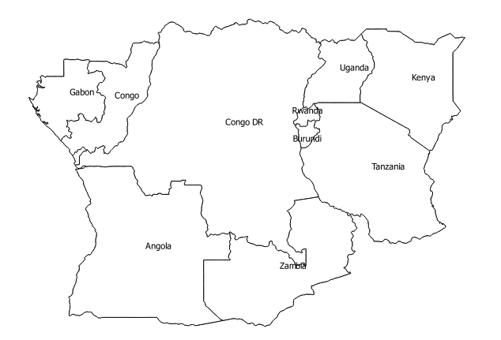

<!-- complied with pandoc -V geometry:margin=1in classification-exercise-QGIS-NB.md -s -o classification-exercise-QGIS-NB.pdf -->

#Classification Exercise

Using the values in the table, colour in the countries in this central part of sub-Saharan Africa according to the percent of forest cover in 2005. Also remember to indicate in the table which colours represent which values. 

| Country Name  | Forest Percent Cover 2005 |
|---|---|
|  Burundi | 5.9 |
|  Kenya |  6.2 |
|  Uganda | 18.4  |
| Rwanda  | 19.5  |
| Tanzania  | 39.9  |
|  Angola | 47.4  |
| Zambia  | 57.1  |
|  Congo DR |  58.9 |
| Congo | 65.8 |
| Gabon | 84.5 |

*Created by Nick Bearman on 12/09/2016, v3.*