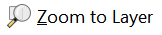
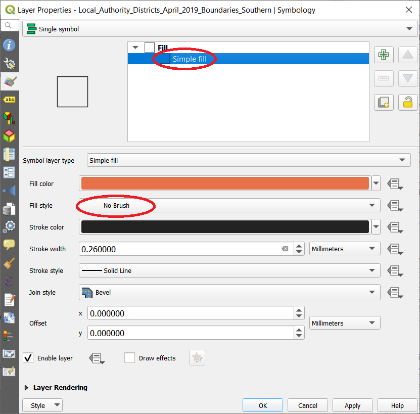
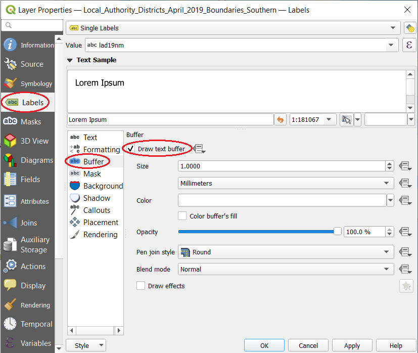
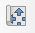

<!-- title: "Introduction to QGIS: Understanding and Presenting Spatial Data" -->
<!-- title: 'Introduction to QGIS: Spatial Data and Spatial Analysis' -->

# Practical 1: Introduction to QGIS

| **Learning outcomes:**  | 
|---| 
| Be able to set up QGIS and add data | 
| Understand how to add data with a latitude & longitude coordinate | 
| Join tabular data to spatial data | 
| Understand how to undertake simple calculations | 
| Understand how to classify data for representation on a map | 

Several conventions have been adopted in the following instructions:

- **Bold** type indicates software commands, options or window names (e.g. **Open**, **Delete** etc.) 
-	A `courier` font is used for folder, file or program names (e.g. `world_countries`) 
-	Accessing a command through a sequence of menus is shown as: 
**View > Zoom Data > Full Extent** 

Many commands require the OK button to be clicked or the Enter key to be pressed after a name has been typed in or an option selected.

File management is very important, so do spend a bit of time making sure you are happy with where the files are stored. If you have questions, please ask!

- Create a new folder in your **Documents** folder called **GIS** (or something similar that you know where it is).  
- Open the OneDrive site and find the `prac1.zip` file.  
- Download it and save the file in the new folder you created.  
- As there are several files they have been compressed into a single zip file, and you will need to first copy this and then extract the data files. Choose somewhere sensible to extract the files to.  
- Start QGIS by clicking on Start, then type **QGIS** and select **QGIS Desktop 3.28.15**. *Your version number might vary, **QGIS Desktop** is the key bit.*  

Let's start off by creating a blank map and adding some data. 

- Start by clicking **Project > New** { height=20 } from the menu at the top of the screen.  
-	Click the **Open Data Source Manager** { height=20 } button.  
- Make sure  { height=20 }  is selected.  
-	Then choose the **Browse** button { height=20 } and navigate to the `prac1` folder we downloaded earlier.  
- Change the option in the drop-down menu on the bottom right to **ESRI Shapefiles**.  
- Select the `world_countries.shp` file, click **Open** and click **Add**.  
- Then click **Close**.  
-	This will add a layer which shows the countries of the world.  

QGIS has a number of different ways of navigating around spatial data. Click on the **Zoom In** tool { height=20 } and draw a box around Europe - the display will zoom in to show this area. To view all of the data, click the **Zoom Full** tool { height=20 }.

*You can also use the mouse wheel to zoom in and out.*

Use the **Pan Map** tool { height=20 } to move around the map by clicking on the tool  and then click and drag around the map. You can also use the mouse wheel to zoom in and zoom out.  Experiment with the zoom and pan tools, and when you are happy, move on to the next section of the practical. 

<!-- This is where the on screen demonstration ends. Carry on with the practical instructions below. -->

The Identify Features tool allows you to select a country on the map and see the attribute information stored in the shapefile about that country.  

-	Select the **Identify Features** tool { height=20 }, and then click on a country.  
-	A window will appear, titled **Identify Results**, with information about the country you selected.  
-	Try selecting different countries, to see how the tool works.  

When we added the `world_countries` shapefile, QGIS randomly assigned a colour. We can change this to something more sensible - green, for instance. 

-	Right click on the `world_countries` entry in the **Layers** window on the left hand side of the screen, and click on **Properties**:

{ width=30% }

-	This will open the **Layer Properties** window, where we can change many different options for how the layer is displayed, as well as other options about the layer.  
-	Click on the { height=20 } **Symbology**  option on the left hand side.  
-	To change the colour, click on the drop down menu next to the colour option:  

{ width=55% }

-	You can then either select one of the pre-set colours, or click on **Choose Color...** and select a colour from the color picker. Use either option, and change the colour to something you like.  
-	Click **OK** and this will close the Layer Properties window and update the colour on the map.  

<!-- 
You may have noticed that when QGIS started, there were lots of toolbars and windows on display. It's helpful to tidy this up a bit so we only have the buttons on display that we need.

-	Right-click on the toolbar (grey area at the top) and you should see something similar to the menu below:

image

necessary? check what it looks like. 

-	You can click different toolbars on/off by checking their checkbox  . Spend some time turning the toolbars on/off to see what the different options do. Once you are finished, leave the following toolbars with their checkboxes checked  : Identify Results; Layers Panel; Attributes Toolbar; Manage Layers; and Map Navigation.

This is a basic set of tools to get you started; we will turn on others as we require them. 

-	You can also use the handle on each tool bar to drag the toolbars around and arrange them as you wish:

image

You should now have a big empty space with a few toolbars. 

-->

-	Using the same process as previously (or select **Layer > Add Layer > Add Vector Layer... > Vector > ...**) add three more shapefiles to the map.  
-	The files to add are: `world_deg30.shp`, `world_lakes.shp` and `world_rivers.shp` shapefiles.  
-	To select multiple files, select the one at the top of the list, hold down Shift on the keyboard and click on the bottom file.  
- You may have a **Select Transformation** box appear. If so, keep the default choice selected and choose **OK**.  

QGIS will add the layers, and again assign a random colour. However, you may not be able to see all the data. This is because the order of the different layers in the Layers window is important. 

-	Re-order the layers (by dragging them up or down) so they are in this order (from top to bottom):  `world_lakes`, `world_rivers`, `world_countries` and `world_deg30`.  
-	Now you should be able to see the three different data sets. We can rename the layers as well - right click on `world_deg30` and select rename. Rename this layer to `oceans` and press enter.  
-	Also use the **Identify Features** tool to investigate some of the new data layers. *You have to select the layer you want to Identify*.  
-	Now is a good time to save the QGIS project file. Select **Project > Save** and save the file somewhere sensible.  

The colours of the different layers will also need to be changed, so update the colours to reflect what the layers represent. 

*The options you have for symbology will depend on what type of spatial data you are dealing with. The countries layer is a polygon layer, so we can change the colour of the polygons. Point layers or line layers will have different options. Experiment with different colours and the other options in the Style section of the Layer Properties window.* 

Remember also to save the project file!

## Adding point data from a CSV file

We have already added polygon data and line data, and now we are going to look at adding some point data. Open up the `world-cities.csv` file included in the zip file - it should open in Excel. You can see the file contains four columns: Name, Latitude, Longitude and Country. As this data has some coordinates, QGIS can plot the data on our map. Close the file (without saving, if Excel asks), and return to QGIS. 

-	Click **Layer > Add Layer > Add Delimited Text Layer...** and click **Browse** { height=20 } and select the `world-cities.csv` file.  
-	You should see the different columns appear at the bottom of the window.  
-	Make sure that **File format** is set to `CSV` and **Geometry Definition** is set to `Point coordinates`.  
- You may need to expand **Geometry Definition**. If it looks like this { height=20 } then click on the arrow { height=20 } so it looks like this:

{ width=80% }

-	Check that **X** field is set to `Longitude` and **Y** field is set to `Latitude`.  
- Make sure that **Geometry CRS** is set to `EPSG:4326 - WGS 84`.  
-	Click **Add**, and **Close**.  

*QGIS may ask what coordinate system the coordinates are in. Make sure **Coordinate Reference System** `WGS 84 - Authority ID EPSG:4326` is selected (type the ID number **4326** in the filter box if needed), and click **OK**.*  

You should now see the 15 cities added to the map. Update the symbols to a colour that fits in with your existing map. 

**Optional Exercise**

See if you can work out how to add a name to each of the cities. Look in the **Layer Properties** window under **Labels**. 

 
## Joining tabular data

We only need the `world_countries` layer for the next exercise, so turn all of the other layers off by clicking on the check box next to each layer entry in the Layers panel. 

{ width=20% }

In order to join tabular data it is necessary that both of your datasets have a common attribute (e.g. a name, unique reference or code). This attribute must be unique (i.e. a country must not be listed twice in your Attribute table) and identical (i.e. the country names must be the same and spelt identically, e.g. "Gambia, The" and "The Gambia" will not join successfully).

-	Right-click on the `world_countries` layer and choose **Open Attribute Table**. You'll see that the **NAME** field is unique (different) for each country.  
-	Close the **Attribute Table**.  
-	In the data files that you copied today you'll notice that there is also an Excel file named `pop2015.xls`. Double-click this file and it should open in Excel. The dataset contains three fields, a unique identifier called UN_Code, the country **NAME** and population data for 2015 called **POP2015**. Close the Excel file once you have finished viewing the data.  

Now that we've identified the two fields in our datasets that we will use to make the join we can move on. 

-	To add our table to the map we need to use the **Open Data Source Manager** { height=20 }. Click on this, and then choose **Browser**  { height=20 }.  
- Open **Home** and navigate to where you downloaded your zip file earlier.  
- There should be a file listed called `pop2015.xls`.  
- Expand { height=20 } this and there should be a file called `pop2015`.  
- Double click on `pop2015` and it will be added to the Layers window.  
- Close the **Data Source Manager**.  
-	The table will now appear as a layer in the Layers window:

{ width=20% }

-	Right-click on the table we have just added (`pop2015`) and **Open Attribute Table** to check that the data appears correctly (if you have all *null* values there has been a problem importing your data, try adding it again). You should see both fields with data populated.  
- Close the attribute table when you have finished viewing the data  
-	Now we will join this table layer with your spatial data. Right-click on the `world_countries` layer, select **Properties** and click on **Joins** { height=20 }.  
-	Click on the **Add new join** button { height=20 } to create a new join. The **Add Vector Join** dialogue box will now open  
-	Make sure that in the **Join layer** dropdown box `pop2015` is selected  
-	In the **Join field** dropdown box `Name` should be selected  
-	In the **Target field** dropdown box `NAME` should also be selected  

{ width=30% }

-	Click **OK** on the **Add Vector Join** window and also in the **Layer Properties** window  
-	Open **Attribute Table** of `world_countries` and you will see that a new field (named `pop2015_POP2015`) has been added to the Attribute table! Please ask for help if this is not the case.  

The join that we have made is not permanent; it is a temporary link between the two datasets. To make the Join permanent we need to save a new copy of the `world_countries` layer.

-	Right-click `world_countries` and click on **Export > Save Features As...**.  
-	In the **Save Vector Layer as** window make sure that the following variables are selected:  
- **Format** is ESRI Shapefile  
-	Save the new layer as `world_countries_updated` in the `prac1` folder (click **Browse** { height=20 } to select the folder and enter the filename)  
-	Leave all other fields as they are  
-	Click **OK** and the new layer will be added to the map. Open the attribute table to check that the new field (shortened to `pop2015_PO`) is present.  

-	Right-click `world_countries` and select **Remove Layer**  
-	If you like, **Save** your project.  

## Adding new fields and calculating values

We will now add a new field to the attribute table and calculate some values (the change in population between 2005 and 2015) using a simple mathematical operation. This can be useful when you want to create new data or undertake some analyses.

-	Open **Attribute Table** of `world_countries_updated`  
-	Click on the **Toggle Editing** { height=20 } button  

{ width=90% }

-	Click on **New field** { height=20 } button  
- -	Set **Name** to `POP_DIFF`  
- -	Leave **Comment** blank  
- -	Set **Type** to `Whole number (integer)`, change **Length** to `10`.  
-	Click **OK**  

You will see that the new field contains values, by default, as *NULL*. We now need to populate this new field (column) with some data.

-	Click on the **Open field calculator** { height=20 } button and the Field Calculator window will open. It is here that we can undertake many types of mathematical calculations  
-	Check the checkbox next to **Update existing field**   { height=20 } and select the field named `POP_DIFF` from the dropdown box  
-	Under the list in the centre, click on the expand arrow  next to **Fields and Values**  
-	Double-click the field named `pop2015_PO` to add it to the **Expression**  
-	Now single-click on the minus (`-`) sign and double-click on `POP2005`. Your expression should look like this:  
- `"pop2015_PO" - "POP2005"`  
- *(notice how the expression builder puts in the double quote marks for you)*  
-	Click **OK** to run the calculation and the `POP_DIFF` field will populate with the calculated values (the first few values should be 9 (Antigua and Barbados), 6399 (Algeria) and 1191 (Azerbaijan), ask if this is not the case)  
-	Finally, click on the **Toggle editing ** { height=20 } button and choose **Save** when prompted. Close the attribute table  
-	**Save** { height=20 } your project.  

By the time you get to this section, we should have completed the 'Classification' discussion and talked about class boundaries and colours. If we haven't yet, please let me know that you have reached this point. 

## Classifying population change

Now we have calculated the change in population between 2005 and 2015, we need to display it on the map. 

-	Open the **Layer Properties** window and the **Symbology** { height=20 } tab of the `world_countries_updated` layer.  
-	Where the option says **Single symbol** at the top, change this to **Graduated**.  
-	Select the `POP_DIFF` field from the **Value** list.  
-	The click **Classify**, you will see the 5 classes for this data set appear in the window.  
-	Click **OK**, and QGIS will update the map.  

Now we have a map of population change. However, there are various things wrong with it. What are they? Have a think, and then chat to your neighbour to see what they think might be wrong. 
There are a number of things you can change to alter the classification:

1.	Try changing the classification method, the default is **Equal Interval**. How do the different methods change the classification of the data. Which is "right"?  
2.	Try changing the number of classes.  
3.	Try changing the colours used - how does this impact the message of the map? (ColorBrewer can be accessed through **Color ramp > Create New Color Ramp > Catalog: ColorBrewer**).  
4.	Try changing the class boundaries - use the **Histogram** tool in QGIS, click **Load Values** to show the histogram.  
5.  Can you use a diverging colour scheme to show increases or decreases in a different colour? 																					 

Once you have finished, remember to save your QGIS Project. 

## Optional exercises

**Classifying % population change**

What else might be wrong with the data we have calculated?

Currently we are comparing the increase in numbers of people between 2005 and 2015 in each country. It might make more sense to compare the % increase. Calculate this and then show this on a map. Why is this a more logical way of representing this data?

**Adding a basemap**

We have the option of adding a base map to the data we have in QGIS. We can do this through XYZ Tiles (within the Browser panel). 

We can also add Google Maps imagery to this as well (although this is not officially supported, and may break). 

- In the Browser window, right-click on **XYZ Tiles** and choose **New Connection...**  
- In Name type `Google Maps`  
- In URL paste in `http://mt0.google.com/vt/lyrs=y&hl=en&x={x}&y={y}&z={z}&s=Ga` *(or copy and paste from the workbook)* 

An alternative option is to use a plugin called QuickMapServices. To install it, click **Plugins > Manage and Install Plugins.**. Search for `QuickMapServices`. Then select the plugin and click **Install Plugin**. Once installed, try **Web > QuickMapServices > OSM > OSM Standard** to begin.  

----

\newpage

# Practical 2: Making a Map

| **Learning outcomes:**  | 
|---|
| Understand how to design and produce a publication-ready map in QGIS |
| Be able to add maps, scale bar, legends and labels to a map |
| Know why scale is important in map design |
| Know how to save and export maps as PDFs or images |

This practical focuses on aspects of map design and symbolisation in QGIS. In particular, it will build upon the skills from the previous practical to look at how QGIS can be used to produce maps that can be easily printed. QGIS has a powerful tool called Print Layout that allows you to view your GIS layers and create maps. An example map is provided at the end of this handout.

We will create the map from scratch and add elements such as north arrow, legends and scale bars. Let's get started! Remember to **Save** { height=20 } your work as you go. 

## Getting and setting up the data

- Download the `prac2.zip` data file.    
- Extract the files to somewhere you can find in the future.  
- Open a new, blank project in QGIS.  
-	We now need to add our data layers to the map.  
- To add our data to the map we need to use the **Open Data Source Manager** { height=20 }.  
- Select **GeoPackage** { height=20 } on the left.  
- Click **New** and then select the `prac2-data.gpkg` file.  
- Make sure that `prac2-data.gpkg` is selected in the list and click **Connect**.  
- Select the `LSOA-IMD-2019-Southern` layer and choose **Add**. Then choose **Close**.  

This shows the data very well, but it isn't that obvious where the data is, particularly if you zoom in. We can add a base map to this.  

- In the browser window in the top left, expand **XYZ Tiles**.  
- Double click on **OpenStreetMap**. This will add a basemap to QGIS. 
- You may need to re-order the layers if the basemap is at the top.  

----

*If this doesn't work, try this approach:*

*If you need to install the **QuickMapServices** plugin:*				   
- *Click **Plugins > Manage and Install Plugins...** *   
- *Type `quick` in the search bar at the top, and select **QuickMapServices** from the list below. *  
- *Choose **Install Plugin**. *  
- *Close the **Plugins** window.*  
- *Choose **Web > QuickMapServcies > OSM > OSM Standard**. This will add an OSM (OpenStreetMap) basemap.*

----

- Zoom in somewhere where you can see the base map. It will add in more detail as you zoom in.   
- When you have finished looking at the map, right-click on the `LSOA-IMD-2019-Southern` layer and choose **Zoom to Layer**  { height=20 } to return to our IMD data.  
- Right click on the `LSOA-IMD-2019-Southern` layer and choose **Properties > Symbology**.  
- Change the **Opacity** to **50%**. 
- If you can't see it, click **Change..** next to **Symbol**. Alter the **Opacity** option to **50%**.
- Choose **OK** and **OK**.  

Now we can see the base map through the IMD data. You may have to experiment with different values of opacity to be able to see both easily. 

The default colours for the IMD data aren't that great, but fortunately we have a Style file, created by Alasdair Rae (see https://www.sheffield.ac.uk/usp/research/projects/english-indices-deprivation-2019 for more details). 

- Right click on the `LSOA-IMD-2019-Southern` layer, choose **Properties > Symbology**.  
- At the bottom of the **Symbology** window choose { height=20 } **Style > Load Style...**.   
- In the **Database Styles Manager** window, under **Load style** choose **From File** and then click the Browse { height=20 } button and select the  `prac2-imd-d-style.qml` file.  
- Your window should look similar to this: 

{ width=30% }

- Click **Load Style** and **OK**. This will load the colours for our IMD Decile layer.  

We can also add some outlines for the Local Authority Districts.   

																			   

- Add in the `Local_Authority_Districts_April_2019_Boundaries_Southern` layer from the same geopackage as we used earlier.  
- If you get the **Transformation** window again, just click OK. 
- Open the **Symbology** window.  
- Select the **Simple fill** option near the top of the window, and the details below should change.  
- Set **Fill Style** to **No Brush** (see screenshot below).  
- Choose **OK**.  

{ width=60% }

- Open the Local Authority layer **Properties** again and this time choose **Labels** { height=20 }  
- Change **No Labels** to **Single Labels**.  
- Set **Value** to `lad19nm` and choose **OK**.  
- *If nothing appears, make sure you have selected `lad19nm`*.  

This adds the Local Authority boundaries to give us some context for the IMD data.

**Optional Exercise**

Try experimenting with adjusting the transparency off - which do you think looks better?

## Creating the map layout

Now we are going to start constructing the map. Have a look at the example at the end of the handout to see what we are aiming to create. You don't have to stick to the design, feel free to adjust and change things as you see fit. 

- Centre the map display in the main QGIS window. Make sure you can see Winchester and Isle of Wight clearly.  
- Click **Project > New Print Layout...** and click **OK**.  
- The **Print Layout** window will now open with a blank page.  
- We are aiming to create a map like the one attached to the back of this workbook, so we need our page to be landscape. Right-click on the blank piece of paper and choose **Page Properties...**.  
- Make sure **Orientation** is set to `Landscape`.  
- Click the **Add Map** button { height=20 }  
- Draw a box about the appropriate size on the left hand side of the page. It should look something like this:  

{ width=60% }

As long as the box is in about the right place, we can tweak the position and size later on.

- Your page might be a bit small. Use the **Zoom Full** tool { height=20 } to zoom in to the page as far as possible.  
- We need to make the labels a bit clearer. Go back from the Layout window to the main QGIS window, and open the **Symbology** window for the `Local_Authority_Districts_April_2019_Boundaries_Southern` layer.  
- Go to **Labels > Buffer** and select **Draw text buffer**. Click **OK**. *See how the labels have a white 'halo' around them now?*  

{ width=90% }

- Go back to the **Layout** window.  
- Make sure you have the map selected (using the **Select/Move Item** tool { height=20}) and click the "Refresh" button { height=20}.  
- This is a very common way to adjust the map and you will do this a lot.  
- You might also need to adjust the scale to get the map looking right. I had a value of around `740000` in the scale box. To adjust, type a number in and press Enter.  
- You can also move the map around with the map window using the **Move item content** tool { height=20}  
- When you have finished moving the map content around, make sure you go back to the **Select/Move Item** tool { height=20}  
- Once you are happy with this bit, select the **Lock layers** and **Lock styles for layers** buttons. This will stop the visible layers and style changing when we alter it for a different map.  
{ width=40% }
- Remember to **Save** { height=20} your map regularly.  

Now we are going to add the main map for Isle of Wight. 

- Go back to the main **QGIS** window and zoom in on the Isle of Wight.  
- Then go back to the **Layout** window and add a new map on the top-left of the page using { height=20}.  

*What do you think of this so far?*

- This is ok, but it would be better to make the Isle of Wight stand out a bit more. We are going to extract the Local Authority outline for just the Isle of Wight, and use this on our map of the Isle of Wight.    

- Go back to the main QGIS window.  
- Make sure you have the Local Authorities layer selected in the Layers window.  
- Use the **Select Features** tool { height=20} to select the Isle of Wight. 
- Once the Isle of Wight is yellow, right-click on the Local Authorities layer and choose **Export > Save Selected Features As...**  
- Make sure **Format** is set to **GeoPackage**.  
- Click **Browse** { height=20 } and select the `prac2-data.gpkg` we have been using already by clicking **Save**.  
- Set **Layer Name** to `LA-Isle-of-Wight` and click **OK**.  
- Click the **Deselect Features** { height=20 } so we don't have anything selected any more.  
- We are going to copy the style from the main LA layer to the new one we have just created.  
- Right-click on the `Local_Authority_Districts_April_2019_Boundaries_Southern` layer and choose **Style > Copy Style > All Style Categories**.  
- Right-click on the `prac2-data — LA-Isle-of-Wight` layer, choose **Style > Paste Style > All Style Categories**.  
- Turn off the `Local_Authority_Districts_April_2019_Boundaries_Southern` layer.  
- Go back to the layout window, make sure the Isle of Wight map is selected, and click **Refresh** { height=20}.  
- If it doesn't look quite right, try experimenting with some other options. If you are happy with it, select the **Lock layers** and **Lock styles for layers** options.  

*The **Copy Style** and **Paste Style** functions copy the style information to the clipboard, just like any other copy and paste function. You can paste the style information into Notepad if you want to have a look at it. It is in XML, and you can pick out the information, e.g. `<prop k="outline_color" v="35,35,35,255"/>` is the outline colour in RGB, 0-255, very very dark grey, not quite black.*

*The map is starting to come together now!*

Have a go at following the same steps as we did for the Isle of Wight for the **Winchester** local authority, and add this map to the top-right corner of the page. 

- The final step is to add some of the additional map marginalia (extra bits like the legend, scale etc.).     
- Make sure you are in the **Layout** window.  
- Choose **Add Item > Add Legend**. Click in the lower-right area of the map. You may need to click **OK**.  
- By default the legend includes all of the visible layers, and will automatically update if we change the layers.  
- In the **Item Properties** window, under **Legend Items** untick **Auto update**.  
- Select the `prac2-data — LA-Isle-of-Wight` layer and click the minus { height=20 } button to remove it.  
- Repeat this for the `prac2-data — LA-Winchester` layer.  
- Select the `Local_Authority_Districts_April_2019_Boundaries_Southern` layer and choose the **Edit Item** { height=20 } button. Change the label to `Local Authority boundaries`.  
- Repeat the same process to update the colours to `1 More deprived` and `10 Less deprived`.  
- Replace the title of `LSOA-IMD-2019-Southern` with `IMD Deprivation Decile`.  
- Remove the `OpenStreetMap` entry.  
- Move the legend to fit in the gap on the page.  
- Click **Add Item > Add Scale Bar** and then click in the remaining gap. You may have to click **OK** again.  
- We have to pick which map the scale bar refers to, and make sure that it is clear on the map. Each map will have a number (Map 1, Map 2 and Map 3) and we need to make sure that the scale bar is referring to the correct map. I chose Map 1, the larger, area map at the bottom.  
- In the Scalebar settings, set **Segments** to `right 5` and **Fixed width** to `5 units`. It should automatically default to `km`.  
- The IMD data is made available under the Open Government license (http://www.nationalarchives.gov.uk/doc/open-government-licence/version/3/) so we need to include an acknowledgement on our map.  
- Click **Add Item > Add Label** and click in the empty space. Type in these details:  
- `MHCLD, 2019. Contains National Statistics data © Crown copyright and database right 2020.` *You can copy and paste the copyright symbol from the Wikipedia copyright symbol page!*  
- Click **Font** and change the font size down to 8 or 9.  

There is a lot more we could do with this map - have an experiment with the options and see what you can find. 

*Map design is often quite subjective and there is not necessarily a **best** map design, so try different options and see what you think about them.*
																																				  
To export a copy of your map:

-	Go to **Project > Layout as PDF**, choose a location and a filename to save your map.  
- Open up your PDF map to see what it looks like!  

----

\newpage

# Practical 2b: Creating Data

| **Learning outcomes:**  | 
|---|
| Be able to work with a range of different data sources |
| Understand and be able to load XY coordinate data and postcode data into QGIS |

## Data with coordinates

In practical 1 we added some world city data using latitude and longitude, but it is worth recapping this as it is something you are likely to need to do frequently. In this practical we are going to add some location data for UK football stadiums, with coordinates in the British National Grid system (Eastings and Northings). 

- Go to https://www.doogal.co.uk and click **Map data > UK football stadiums**.  
- Click **Download** and choose **Data in CSV**.  
- Save this CSV file somewhere you can find it.  
- Open the file in Excel and have a look at the data. Key bits are the **Name**, **Latitude**, **Longitude** and **Easting** & **Northing**. 
- Close the Excel file, and open **QGIS**.  

-	Click **Layer > Add Layer > Add Delimited Text Layer...** and click **Browse** { height=20 }.  
- Select the `stadiums.csv` file.  
-	You should see the different columns appear at the bottom of the window.  
-	Make sure that **File format** is set to `CSV` and **Geometry Definition** is set to `Point coordinates`.  
- You may need to expand **Geometry Definition**.

Now we have a choice - we can use the **Easting** & **Northing** fields (which are in British National Grid, `EPSG:27700 - OSGB / British National Grid`) or the **Latitude** & **Longitude** fields (which are in `EPSG:4326 - WGS 84`). This time we are going to use British National Grid.  

-  Check that **X** field is set to `Easting` and **Y** field is set to `Northing`  *(remember that the X-axis goes "a-cross", or left/right, east/west, so we need Easting here)*.  
- Make sure that **Geometry CRS** is set to `EPSG:27700 - OSGB / British National Grid`. If it is not in the drop down list, click **Select CRS** { height=20 } and search for `27700` in here. 
-	Click **Add**, and **Close**.  

- This should show the football stadiums. To check they are in the correct place, add the OSM Basemap we used previously (*XYZ Tiles > OpenStreetMap or Web > QuickMapServices > OSM > OSM Standard*). 

## Data with postcodes (cloud-based)

In the session today we showed you how to plot data with XY coordinate data. We used the world-cities data which had coordinates in latitude-longitude and we used the Add XY data tool in QGIS to turn the coordinates into spatial data and to add them to the GIS project. 

What if we have some UK postcodes data like the list shown below? How do we get that into QGIS?

    M45 7SQ
    NR7 8EX
    GL12 7JU

There are a couple of ways of doing this. The first one is using a website called www.doogal.co.uk which will geocode the addresses we have. Geocoding takes text based information (a postcode in this case), and returns a set of coordinates. We can then use the coordinates to add these data to our GIS. 
  
- Open the `postcode-input-file.csv` file from `prac2.zip` and have a look at the data.  
- Go to `https://www.doogal.co.uk/BatchGeocoding.php`  
- Copy and paste the text from `Postcode` column into the 'Postcodes' box on the webpage  
- Hit **Geocode**  

    <!--  
    blah for spacing
  -->
    
- Wait a short time while the geocoding takes place  
- When it finishes, check the map to see that some icons have appeared on it.  
- Click on the **Text** tab to file the data with coordinates.  
- Click **'Download text'** 
- Save the file (`locations.csv`) somewhere you can find it later 

**Things to remember:**

- There must not be any quote marks (`"`) in the addresses  
- Always check the output - not all of the geocoding may be successful  

The next step is to add the data to QGIS. 

- Open **QGIS** 
-	Click **Layer > Add Layer > Add Delimited Text Layer...** and click **Browse** { height=20 }.  
- Select the `locations` file.  
-	Make sure that **File format** is set to `CSV` and **Geometry Definition** is set to `Point coordinates`.  
- Again, we can choose British National Grid, or Latitude Longitude.  
-  Check that **X** field is set to `Easting` and **Y** field is set to `Northing`  
- Make sure that **Geometry CRS** is set to `EPSG:27700 - OSGB / British National Grid`. If it is not in the drop down list, click **Select CRS** { height=20 } and search for `27700` in here. 
-	Click **Add**, and **Close**. 

{ width=60% }

- Click **OK** 

- Check the data - do they look sensible for the addresses? *(You may need to add some base map data)* 
  

## Data with postcodes (non-cloud-based)
   

It may be that you don't want to share your data with another website, or you have too many rows for the Doogal website. If you don't, there is another option. 
																														 
																									   
  

You can download the Code-Point Open dataset from Ordnance Survey at https://osdatahub.os.uk/downloads/open. This is a list of all the postcode centroids in GB. 

The CSV version contains a CSV file for each postcode area (e.g. `TR`) and within this file is each postcode unit (e.g. `TR1 1AA`) and the coordinates for that postcode unit. You can join this to your list of postcodes in QGIS, and use that to plot the data. 

The GeoPackage version is much much larger, but contains all the data in one geopackage layer, so if you have data across more than one postcode area, you can geocode the data all in one go. 

----

*This practical was written using QGIS 3.28 on Windows 11, last updated on 08/02/2024 by Dr Nick Bearman, [nick@nickbearman.com](mailto:nick@nickbearman.com). Thanks to Chris Bell for providing the geocoding resource at https://www.doogal.co.uk.*

This work (Introduction to QGIS: Spatial Data and Spatial Analysis by Nick Bearman) is licensed under the Creative Commons Attribution-NonCommercial-ShareAlike 4.0 International. To view a copy of this license, visit http://creativecommons.org/licenses/by-nc-sa/4.0/. 

The latest version of the PDF is available from https://github.com/nickbearman/intro-qgis-spatial-data. This is v6.1 and this was created on `r format(Sys.time(), '%d %B %Y')`. 

{ width=100% }
