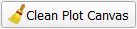
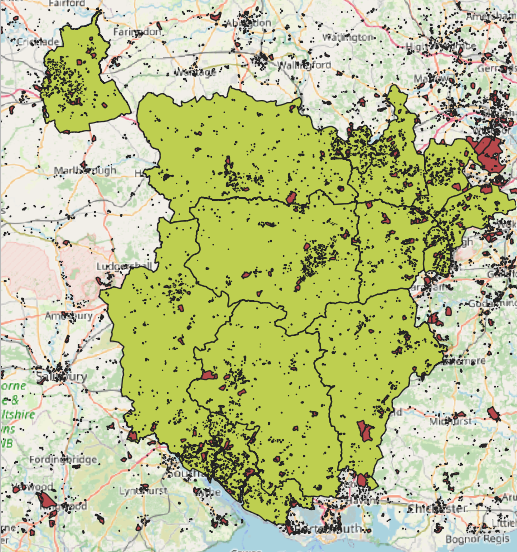

# Practical 3: Greenspace Access Points

| **Learning outcomes:**  | 
|---| 
| Know how to download data from Ordnance Survey Open Data |
| Be able to complete point in polygon anaylsis in QGIS |
| Understand how to create graphs in QGIS |

I have done some preparatory work for you already with this data. Download the `prac3-data.zip` file and extract the `prac3-data.gpkg` file from it. 

- Open **QGIS** and start a new project.  
- In the browser window on the top-left, right click on { height=20 } and choose `New Connection...`.  
- Browser to the `prac3-data.gpkg` file you extracted earlier, select it and choose **Open**.  
- Expand the geopackage and your **Browser** window should look like this:

{ width=40% }

- Add the 
`LA-with-IMD-pop` layer by double clicking on it.  

This will add a polygon layer of some local authorities in southern England. Explore the data a bit, and add a base map if you like. 

- Open the **Attribute Table** and see what columns of data there are. There are various measures of IMD (`IMD_IMD - Average score` being the most useful) and some population data (`Pop2019`).  

We will be making use of this data later on in our analysis. 

- Close the **Attribute Table**.  

## Point in Polygon Analysis

Using our Local Authority datasets, we are going to complete some calculations on Greenspace access and area.

- Do a Google search for `os open data`.  
- **OS OpenData download - OS data downloads | OS Data Hub** should be the first hit - go to this page.   The web address is https://osdatahub.os.uk/downloads/open.  
- Search (or scroll down) to find **OS Open Greenspace** and click the link.  
- Choose **Set a custom area:**  
- Click on the **SU** entry on the map of the British Isles to select the SU tile of data and click **Save selection**.  
- Set the **Data format:** to `ESRI Shapefile`.  
- Click the link **OS Open Greenspace - ESRI® Shapefile SU (2.3 MB)** to download.  
- Unzip the data and have a look at the files - in the data folder there should be two shape files `SU_AccessPoint.shp` and `SU_GreenspaceSite.shp`.  

<!-- Last checked 2022-03-02 -->

Now we can move to QGIS. Reopen your existing project from the previous practical, and save as a new project.  

- Select from the menu **Layer > Add Layer > Add Vector Layer** { height=20 }.  
- **Browse** { height=20 } to the `SU_AccessPoint.shp` file and add it.  
- Pan to the Winchester local authority (try labelling them as we did yesterday if you need to).  
- Each of the dots is an access to an area of greenspace. Try using the **Identify Features** tool { height=20 } to see what information we have about each access point.  
- Zoom in and have a look at the points. It may be useful to add the OSM Basemap layer, like we did yesterday.  

By default, the OSM Standard basemap uses the WGS84 / Pseudo Mercator projection. Most of the data we will be using will be in British National Grid. QGIS will automatically re-project GIS data if it knows what the coordinate system is. QGIS has a 'Project CRS' which is what the data are shown in the main window. Depending on your settings, this may be set to **EPSG:3857** (WGS 84 / Pseudo Mercator) or **EPSG:4326** (WGS 84).  

- If the CRS symbol { height=20 } at the bottom right hand side of the QGIS window says **EPSG:3857** or **EPSG:4326**, click on it.  
- Type `27700` in the **Filter** box and select **OSGB 1936 / British National Grid** - **EPSG:27700**.  
- Click **OK**. Now QGIS will re-project everything to British National Grid (27700).  

Now we are going to group the data within each Local Authority. First, we will use **Point-in-Polygon** analysis to count how access points to greenspace there are in each Local Authority polygon. 

- Click **Processing > Toolbox**.  
- Type `count points` in the search box.  
- Double-click **Vector analysis tools > Count points in polygons**.  
- Set **Polygons** to your Local Authority districts layer *(which should have IMD and population data in it).*  
- Set **Points** to `SU_AccessPoint`.  
- Click **Run**.  
- This has created a new layer called `Count`.  
- Some of the layers should have points in - remember, the SU grid square doesn't cover all of the local authorities, so some will be blank and some will be incomplete.  
- You can sort the `NUMPOINTS` column by clicking on the column header. It will sort it first ascending, then if you click again, descending.  
- If the calculation has worked, save this as a new layer.  

Have a go at symbolising this data. 

We can also use some of the graphing options within QGIS to explore this data. 

- Click **Plugins > Manage and Install Plugins**  
- Search for **Data Plotly**  
- Click **Install Plugin**.  
- Click **Close**.  
- Click **Plugins > DataPlotly > DataPlotly**.  
- If it opens a tiny window in the bottom left hand corner, drag the window to the middle of the screen and make it bigger.
- Make sure **Plot type** is set to `Scatter Plot`.  
- Set **Layer** to `Count` (or your new layer if you saved it).  
- Set **X field** to `NUMPOINTS`.  
- Set **Y field** to `IMD_IMD - Average score`.  
- Choose **Create Plot** *it might take a few seconds to run*.  

*If `IMD_IMD - Average score` isn't visible, you may have not done a join correctly earlier on. Try a different field, and try re-doing the join. If you need it, the layer `prac3-data-nb lad-imd-pop-SUgreenspace` will all the information is available in the `prac3-complete.gpkg` GeoPackage - ask me for it.*

If you end up with multiple sets of points on your plot, you can use the { height=20 } button on the main Plotly page { height=20 } to clear the plot and start again. 

Is there any sort of relation in this data? 

What might be a better calculation is to look at number of greenspace access points per population, so we can correct for the fact that some local authorities have bigger populations than others. 

- Close the DataPlotly plot.  
- Open the attribute table for the layer we are using and click the Editing icon { height=20 }.  
- Click **New Field** ({ height=20 })  
- Set **Name** to `GreenAccessPerPop`  
- Set **Type** to `Decimal Number (real)`  
- Click **OK**.  
- Click **Field Calculator** { height=20 }.  
- Choose **Update existing field** and set to `GreenAccessPerPop`.  
- Expand **Fields and Values** and double click `NUMPOINTS`.  
- Click **Divide** `/`  
- Double-click our **Pop2019** field. *Expand the section of the window if you need to*.  
- Click **Multiply** `*` and type in `1000`. This will then calculate the number of greenspace access points per 1000 people.  
- The Expression box should contain something like this:  
`  "NUMPOINTS"  /  "prac3-data-nb MYE2 - Persons Refactored_Pop2019"  * 1000 `.  
- It should give you a preview value for **Arun** of `1.225`.  
- Click **OK**.  
- Save the data.  
   

Try symbolising this data and/or graphing the data - do you see any patterns here?

\newpage

# Practical 4: Spatial Overlay - Greenspace and Local Authorities

| **Learning outcomes:**  | 
|---| 
| Be able to perform a polygon polygon overlay |
| Critique the analysis process we have undertaken |

This is a lighter touch practical. You will need to work out some of the steps for yourself!

## Polygon Polygon Overlay

We will be combining the layers using the Union tool, and we need to do some preparation for this. 

- Open up your project file from the previous practical, and save it as a new file (e.g. `prac4-NB-v1.qgz`).  
- Add the `SU_GreenspaceSite.shp` to our project.  Now is also a good time to remove any layers we don't need, for example many of the CSV datasets we joined.  
- It is always good practice to work on a copy of your data, so take a copy of our geopackage from the previous practical, save it in the `prac4` folder. I have called mine `prac4-data.gpkg`.  
- Then we can add the greenspace area data to this prac4-data.gpkg geopackage.  
- To do this, right click on the layer (`SU_GreenspaceSite`), choose **Export > Save Features As**.  
- Select the `prac4-data.gpkg` geopackage.  
- Call the layer `SU_GreenspaceSite` and choose **OK**.  
- It will appear as `prac4-data — SU_GreenspaceSite`.  

The greenspace layer and the LA layer don't cover the same area, so we need to remove the local authorities for which we don't have complete greenspace data. 

There are various ways of doing this - the easiest is manually!

- Save the local authorities layer (which should already have the IMD and population data in it) into our `prac4-data` geopackage using the same method as above. Call it `lad-imd-pop-SUgreenspace`.  
- Remove the `prac3-data lad-imd-pop-SUgreenspace` layer, so we only have one local authority layer.  
- Select the `prac4-data lad-imd-pop-SUgreenspace` layer and start editing { height=20 }. 
- Use the **Select Features** { height=20 } tool to pick one of the local authorities for which we do not have complete greenspace data. It should go yellow, with a red outline. 
- Use the `Delete` key on the keyboard to delete this polygon.  
- Repeat this for each of the local authorities poking out of the greenspace data. You should end up with something like this:

{ width=60% }

- We also need to do one final bit of preparation on the local authority data - calculate and add the area to the attribute table.  
- Open the attribute table for the `prac4-lad-imd-pop-SUgreenspace` layer.  
- Turn on **Editing** { height=20 } and click **Add Field** ({ height=20 }).  
- Set the **Name** to `LAarea`.  
- Set **Type** to `Decimal number (real)`.  
- If you have the option, set **Length** to `10` and **Precision** to `4`. *If you don't have these options, that is fine.*    
- Click **OK**.  
- Click **Field Calculator** ({ height=20 }).  
- Choose **Update existing field** and set to `LAarea`.  
- Expand **Geometry** and double-click `$area`. This will add the area in square meters (as our coordinate system is BNG).  
- This should come out (as a preview)  at `634273160` (m) for Basingstoke and Deane.    
- Add `/ 10000` to our expression to divide this by 10,000, to get 63,427 hectares.  
- Click **OK** to apply the calculation across all the rows.  

- Make sure to turn Editing off { height=20 } and save your edits.  

- In the `prac4-data — GreenspaceSite` layer add a new column called `greenspace`.  
- Use **New Field** { height=20 } and set the data type to **Whole number (integer)**.  
- Then use **Field Calculator** { height=20 } to set all the entries in this column to `1`.   
- Find and open the **Union** tool in the **Processing Toolbox**.  
- Set the **Input layer** to `prac4-data lad-imd-pop-SUgreenspace` (our local authority data).  
- Set the **Overlay layer** to `prac4-data SU_GreenspaceSite` (the greenspace site layer).  
- Click **Run**, it may take a minute or two to run. Watch the progress bar, and while you wait, review the flowchart on the slides and make sure you know what output you are expecting (or have a short break!).   

- Open the attribute table of the layer we have just created (`Union`).  

Now we have an attribute table split by Local Authority and greenspace. Within each Local Authority we have one polygon that is non greenspace (where `greenspace` is NULL) and one or more polygons that are greenspace (where `greenspace` is `1`). The next step is to calculate the area for each polygon. 

*We do have quite a few completely blank rows (with greenspace data but no Local Authority data). These are the greenspace areas that are outside our local authority data. Try selecting one and using the Zoom To function.*

- Save this as a new layer called `greenspace-LAs`. You will get this error message if you save it in a GeoPackage:

{ width=40% }

*It won't save in the geopackage (because `fid` is not unique, one of the requirements). We could save it as an ESRI Shapefile which will be fine. The better way is to remove and recalculate the `fid` field, which will then be unique, so we can save it in a geopakcage.*

- Open the Attribute Table for the `Union` layer and delete the `fid` field. Then try saving again.  
_ You might then also get this error:

{ width=50% }

- This is saying this layer already exists in the geopackage (as we saved it earlier, but it didn't save properly because of the error). Click **Overwrite Layer** to overwrite this with the new (correct) layer. 
- **Be careful because you could overwrite the whole geopackage!**

- Open the attribute table for the `greenspace-LAs` layer.  
- Turn on **Editing** { height=20 } and click **Add Field** ({ height=20 }).  
- Set the **Name** to `area`.  
- Set **Type** to `Decimal number (real)`.  
- Set **Length** to `10` and **Prevision** to `4` *if you have them*.   
- Click **OK**.  
- Click **Field Calculator** ({ height=20 }).  
- Choose **Update existing field** and set to `area`.  
- Expand **Geometry** and double-click `$area`. This will add the area in square meters (as our coordinate system is BNG).  
- Add `/ 10000` to our expression to divide this by 10,000, to get the value in  hectares.  
- Click **OK** to apply the calculation across all the rows.  
- Turn Editing off.  

Now we can merge the polygons so we have a dataset that lists each Local Authority area twice, once with greenspace and once without. 

- Make sure everything is de-selected (by clicking { height=20 })  
- Use the **Dissolve** tool from **Processing Toolbox** (under **Vector geometry**).  
- Set **Input** to `greenspace-LAs`.  
- Click the Browse { height=20 } button next to **Dissolve field(s)**.  
- Select `lad19cd` and `greenspace`. Choose **OK**.  
- **Run**.  
- Look at the new layer, `Dissolved`. Has it done what we wanted it to?  
- Save as `dissolved-greenspace-LAs`.  
- Open the attribute table and use **Select features using an expression** { height=20 } to select the rows where `greenspace = 1`.  
- Save this as a new layer `dissolved-greenspace-LAs-single` using **Save Selected Features As...**.  
- Use **Field Calculator** to create a new field (`pc_greenspace`) and calculate the percentage of greenspace (`("area"  /  "LAarea" ) * 100`). 

<!-- check field format, some are text for area etc. -->

This gives us a nice output of the proportions of greenspace. 

Try creating a plotly graph with this - is there any relationship now? What about area of greenspace per thousand people?

We could perform a similar process, but with the greenspace buffered. This would be a proxy for 'accessible' green space. Try buffering the greenspace data at 300m, and repeat the process. 

----

*This practical was written using QGIS 3.22 on Windows 10, last updated on 04/06/2022 by Dr Nick Bearman, [nick@geospatialtrainingsolutions.co.uk](nick@geospatialtrainingsolutions.co.uk).*

This work (Introduction to QGIS: Spatial Data and Spatial Analysis by Nick Bearman) is licensed under the Creative Commons Attribution-NonCommercial-ShareAlike 4.0 International. To view a copy of this license, visit http://creativecommons.org/licenses/by-nc-sa/4.0/. 

The latest version of the PDF is available from https://github.com/nickbearman/intro-qgis-spatial-data. This is v6.0 and this was created on `r format(Sys.time(), '%d %B %Y')`. 