<!-- title: 'Introduction to QGIS: Spatial Data and Spatial Analysis'-->

# Practical 3a: Recap of QGIS and Choropleth Maps

| **Learning outcomes:**  | 
|---| 
| Remember how to load data, join data and symbolise data | 

*If you get stuck, a video recording of me working through this practical is available on [YouTube](https://youtu.be/Gvg-YzUWSDA).* 

We are going to start with a quick recap of QGIS, including loading data and creating a choropleth map. Create a folder in Documents where you can save files relating to your GIS practical (e.g. `prac3`). 

We are working with the IMD (Index of Multiple Deprivation) data, and rather than working at the usual LSOA level, we are working at the Local Authority level. 

- Open **QGIS** and start a new project.  
- Open the **Open Data Source Manager** { height=20 } 

- Add the 
`southern_england-counties_unitary_authorities_dec_2024` layer from the `prac2-data.gpkg` geopackage in `prac2.zip` from the OneDrive folder.

- *Remember to use the **GeoPackage** option and click **New** to connect to a new geopackage.*

- We are going to work with data at the Local Authority level initially. We can get the IMD data summariesed by Local Authority. See [https://www.gov.uk/government/statistics/english-indices-of-deprivation-2025/english-indices-of-deprivation-2025-statistical-release#how-to-use-the-indices-of-deprivation](https://www.gov.uk/government/statistics/english-indices-of-deprivation-2025/english-indices-of-deprivation-2025-statistical-release#how-to-use-the-indices-of-deprivation) for more details. 
- To download the data, go to [https://communitiesopendata-communities.hub.arcgis.com/datasets/6e8edb2974da4834bbafa09644a5b02d_0/explore?location=52.684195%2C-2.489482%2C7.17](https://communitiesopendata-communities.hub.arcgis.com/datasets/6e8edb2974da4834bbafa09644a5b02d_0/explore?location=52.684195%2C-2.489482%2C7.17).
- We have a range of options here. We are going to download the CSV file, and then join this to our existing Counties Unitary Authorities layer. 
- Click **Download** and then choose **CSV**. *It make take a few seconds to download.* Save this file somewhere you can find it. 

- Open this file in Excel to have a look at it. We have a number of columns: 
  - `CTYUA24CD` code for the Local Authority which we will be using to join the data 
  - `CTYUA24NM` name of the Local Authority
  - `RAvgRank`: (Rank of) Average Rank
  - `RAvgScor`: (Rank of) Average Score 
  - `RPLMD10`: Proportion of LSOAs in most deprived 10% nationally 

- We are going to use (Rank of) Average Rank as the summary for our analysis. See section [7 Local Authority District Analysis](https://www.gov.uk/government/statistics/english-indices-of-deprivation-2025/english-indices-of-deprivation-2025-statistical-release#local-authority-district-analysis) for more details. 

- In QGIS open the **Open Data Source Manager** { height=20 } and use the **Delimited Text** option to add the CSV file you have just downloaded.
- Use the **Browse** 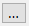{ height=20 } option to select the file. 
- Make sure **File Format** is set to **CSV**
- **Geometry Definition** is set to **No geometry**
- In the **Sample Data** option, check the data types - our code and name fields should be set to **Text** and our rank and score fields set to **Integer**. 
- It should look like this:

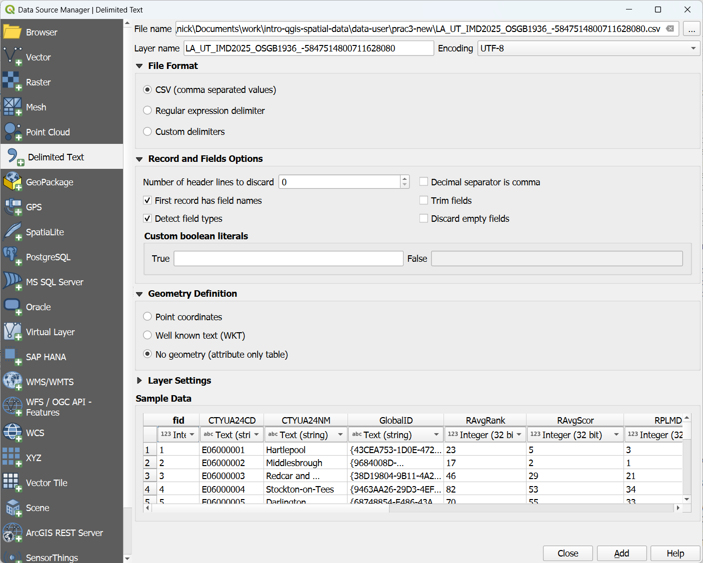

- Click **Add**.  
- Close the **Data Source Manager**.  
- Right click on the layer you have just added and **Open Attribute Table**.  
- We are going to join this layer to the existing Counties Unitary Authorities layer using the code for each local authority - the `CTYUA24CD` field in both layers.   
- Close the attribute table.  
- Right click on the `southern_england-counties_unitary_authorities_dec_2024` layer and choose **Properties**.  
- Click on **Joins** { height=20 }.  
-	Click on the plus button { height=20 } to create a new join. The **Add Vector Join** dialogue box will now open  
-	Make sure that IMD layer is selected in the **Join layer** dropdown box (mine was called `LA_UT_IMD2025_OSGB1936_-5847514800711628080`).  
-	`CTYUA24CD` should be selected in the **Join field** dropdown box  
-	`CTYUA24CD` should be selected in the **Target field** dropdown box  
- Click **OK** and **OK** again.  
- Check whether the join worked correctly by looking the in the `southern_england-counties_unitary_authorities_dec_2024` layer Attribute Table.  
- Each Counties Unitary Authorities should now have an `RAvgRank` and `RAvgScor` column.  
- What do these fields represent? Check the details on the website and in the Excel file if you are not sure.  
- *The fields will have really long names - we will tidy this up shortly.*

The join that we have made is not permanent; it is a temporary link between the two datasets. To make the Join permanent we need to save a new copy of the local authorities layer. Try saving this into a new GeoPackage. 

- Save our joined layer as a new layer called `southern_englandcounties_unitary_authorities_dec_2024_imd` in a new GeoPackage called `prac3-data.gpkg`.  

- Remember to choose the GeoPackage file name (click Browse) and the layer name:

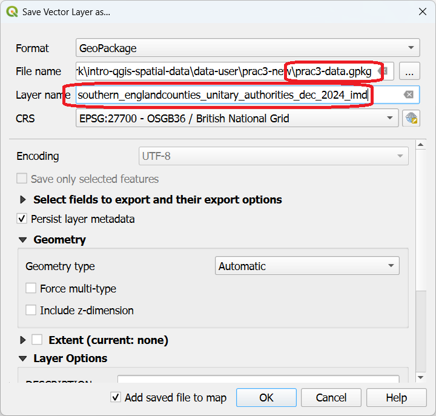{ width=40% }

Now our data is in, and joined to our spatial data, let's tidy up the column names.

- Open the **Layer Properties** window and the **Fields** tab. 
- Click the **Edit** 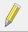  button at the top of the window. 
- Double click the `RAvgRank` and `RAvgScor` fields with the long pre-fix and rename them to just `RAvgRank` and `RAvgScor`.
- Turn Editing off by clicking the **Edit**   button at the top of the window. 
- Choose **Save**.
- Click **OK**. 

Now we can create a choropleth map. Remember how important the classification process is - which classification method we choose can have a big impact on the map we create. 

- Open the **Layer Properties** window and the **Symbology** tab of the layer.  
- Where the option says **Single symbol** at the top, change this to **Graduated**.  
- Select the `RAvgRank` field from the column drop-down list.  
- The click **Classify**, you will see the 5 classes for this data set appear in the window.  
- Click **Apply** or **OK**, and QGIS will update the map. 

*This should show a map showing north and east London with the most deprived areas, along with the Isle of Wight (lower values) and everywhere else being relatively least deprived.* 

*If you get to the end of the recap, and are happy with what we have covered, please carry on with the next practical. If some things are unclear, then please ask for help.*

----

\newpage

# Practical 3b: Joining Population Data

| **Learning outcomes:**  | 
|---| 
| Be able to join data from a variety of sources |
| Know how to change data from one data type to another |

We are now going to join some more tabular data - populations this time. We need to download some data to begin with. 

- Continue with your existing QGIS project.  
- Go to https://www.ons.gov.uk/peoplepopulationandcommunity/populationandmigration/populationestimates/datasets/populationestimatesforukenglandandwalesscotlandandnorthernireland.  
- We want the **Mid-2024 edition of this dataset** data. Click on the **xlsx (1.0 MB)** rectangle to download it.  
- The file is called `mye24tablesuk.xlsx` and save it somewhere you can find it.   
- Have a look at the file we have just downloaded in Excel.  
- We are using the `MYE2 - Persons` sheet, and column A has the LA code in it, and column D has the total population in it.   
- In QGIS open the **Open Data Source Manager** { height=20 } and use the **Browser**  option to browse to the Excel file you have just downloaded. If you are not sure where to start, open **Home** and go from there. 

- *If you are on an institutional managed computer, you may not be able to access your files through here. An alternative approach is to drag and drop the Excel file onto the QGIS window and then choose the `MYE2 - Persons` sheet to add. Or you can convert the Excel file to a CSV file, and add it like we did the IMD data.*

- Double click on the `mye24tablesuk.xlsx` file and then double click on `MYE2 - Persons` to add it to QGIS.  
- Close the **Data Source Manager**.  
- Right click on the layer you just added and **Open Attribute Table**.  
- Again, we are going to be joining the LA codes, but QGIS has rather unhelpfully labelled the columns `Field1`, `Field2` etc., so we will need to rename these. To do this, we need to save it as a layer first.   
- Close the attribute table.  
- Save this layer (`MYE2 - Persons`) into the geopackage you created in practical 3a (**right-click > Export > Save Features As...**).  
- *As this is only a table of data, it won't have a valid projection, so QGIS listing CRS: Invalid Projection is fine.* 
- Remove the old `MYE2 - Persons` layer so we don't get confused. *If you are not sure which is which, hover the mouse over the layer and it will popup with the path - where the file is stored. Or right click on the layer, choose Properities > Source.*
- Right click on the `prac3-data — mye2__persons` layer and choose Properties. Go to the { height=20 } **Fields** option.  
- This list all the columns in the data set and what data types they are.  
- We need to update the field names and types. 
- Click the **Edit** { height=20 } icon and change `Field1` to `LAcode` and `Field4` to `Pop2024`.  
- Delete all of the other fields starting `Field` by selecting them and using the **Delete field** 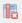{ height=20 } button. You should be left with `fid`, `LAcode` and `Pop2024`. 
- Untoggle Editing { height=20 } and choose **Save** when prompted.   

The `Pop2024` column contains population data, but QGIS thinks it is a Text (string) data. QGIS then wouldn't be able to display the data, or create a choropleth map with it. We need to change the format from Text (string) to Double (number).

- Close the **Layer Properties** window. 

- Click **Processing > Toolbox**.  

*If the **Processing** option is not visible (between Mesh and Help on the menu bar at the top of the screen) you may need to enable it. Go to **Plugins > Manage and Install Plugins**. Go to **Installed** and search for **Processing**. Click **Close** and **Processing** should appear in the menu bar between Mesh and Help.* 

- Type `Refactor` in the search box.  
- Double click on **Refactor fields** *it might take a little while to load*.  
- Increase the size of the **Refactor Fields** window so you can see the different sections clearly.  
- Make sure we have our `MYE2 - Persons` layer in the **Input Layer** box.  
- Change our **Pop2024** field from `Text (string)` to `Decimal (double)`.  
- Click **Run**.  
- *If it gives us an error message this may not be a problem - check the output.*  
- When it has finished running, click **Close**.  

This has added a new layer called **Refactored**. It has a little memory chip icon { height=20 } next to it, which means it isn't saved anywhere. 

- Open the Attribute Table of the **Refactored** layer to check the output. Does the **Pop2024** column have the correct data in it?

- Use the **Fields** view in **Properties** to check that the **Refactored** layer now has the population data in the correct data type. Also check in the **Attribute Table** that the data look sensible.    
- Right click on the layer and choose **Export > Save Features As...** and save it in our GeoPackage. Call it `pop2024`. This will make the layer permanent. Remove the temporary layer.  

Now our layer is ready to join. 

*We had to use **Refactor** because QGIS can't read Excel files in the same way it can read CSV files. An alternative method is to save the MYE 2 - All Persons tab from the Excel file as a CSV file, and then read that in using Add Delimited Text, like we did before with the LA IMD data. Then we wouldn't need to worry about Refactor. I just wanted to show you the options, but usually I would recommend saving Excel files as a CSV file to make things easier!* 

- We are going to join this layers on to our `southern_englandcounties_unitary_authorities_dec_2024_imd` layer using the code for each local authority - the `CTYUA24CD` in the Counties Unitary Authorities boundary file and the `LAcode` in the IMD-pop.  
- Right click on the `southern_englandcounties_unitary_authorities_dec_2024_imd` layer and choose **Properties**.  
- Click on **Joins** { height=20 }.  
-	Click on the plus button { height=20 } to create a new join. The **Add Vector Join** dialogue box will now open  
- `prac3-data - pop2024` should be selected in the **Join layer** dropdown box  
-	`LAcode` should be selected in the **Join field** dropdown box  
-	`CTYUA24CD` should be selected in the **Target field** dropdown box  
- Click **OK** and **OK** again.  
- Check whether the join worked correctly by looking the in the Local Authority layer Attribute Table.  
- Each Local Authority should now have a population as well as the IMD data from earlier.  

The join that we have made is not permanent; it is a temporary link between the two datasets. To make the Join permanent we need to save a new copy of the local authorities layer. Try this, based on what you did earlier. Save this layer as `counties_unitary_authorities_dec_2024_imd_pop2024` You can always go back and check yesterday's notes if you need to!

*We should have done the presentation on greenspace access points by the time you get to here. If you get to this point and we haven't, please let me know.*

Try symbolising the different data - IMD and population on the map. What colours / classification works best?

This is also a great opportunity to tidy up your data. We have a lot of columns we don't need. Feel free to remove them. We will need `FID`, `CTYUA24CD`, `CTYUA24NM`, `RAvgRank`, `RAvgScor` and `Pop2024`. Everything else can go. 

----

\newpage

# Practical 3c: Greenspace Access Points

| **Learning outcomes:**  | 
|---| 
| Know how to download data from Ordnance Survey Open Data |
| Be able to complete point in polygon anaylsis in QGIS |
| Understand how to create graphs in QGIS |

## Point in polygon analysis

Using our Local Authority datasets, we are going to complete some calculations on Greenspace access and area.

- Do a Google search for `os open data`.  
- *Open Data Downloads - OS Data Hub - Ordnance Survey* should be the first hit - go to this page.   The web address is https://osdatahub.os.uk/downloads/open.  
- Search (or scroll down) to find **OS Open Greenspace** and click the link.  
- Choose **Set a custom area:**  
- Click on the **SU** entry and the **TQ** entry on the map of the British Isles to select the SU & TQ tiles of data and click **Save selection**.  
- Set the **Data format:** to `ESRI Shapefile`.  
- Click the link **OS Open Greenspace - ESRI® Shapefile SU (2.76 MB)** and **OS Open Greenspace - ESRI® Shapefile TQ (5.17MB)** to download.  
- Unzip both files and have a look at the files
- In each `data` folder there should be two shape files `SU_AccessPoint.shp` and `SU_GreenspaceSite.shp`, `TQ_AccessPoint.shp` and `TQ_GreenspaceSite.shp`.  

<!-- Last checked 2026-02-28 -->

Now we can move to QGIS. Reopen your existing project from the previous practical (3b), and save as a new project.  

- Select from the menu **Layer > Add Layer > Add Vector Layer** { height=20 }.  
- **Browse** { height=20 } to the `SU_AccessPoint.shp` & `TQ_AccessPoint.shp` files and add them.  
- Each of the dots is an access to an area of greenspace. Try using the **Identify Features** tool { height=20 } to see what information we have about each access point.  
- Zoom in and have a look at the points. It may be useful to add the OSM Basemap layer, to provide some context *(Hint: XYZ Tiles in the Browser panel)*.  

By default, the OSM Standard basemap uses the WGS84 / Pseudo Mercator projection. Most of the data we will be using will be in British National Grid. QGIS will automatically re-project GIS data if it knows what the coordinate system is. QGIS has a 'Project CRS' which is what the data are shown in the main window. Depending on your settings, this may be set to **EPSG:3857** (WGS 84 / Pseudo Mercator) or **EPSG:4326** (WGS 84) or **EPSG:27700** (British National Grid).  

- If the CRS symbol 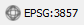{ height=20 } at the bottom right hand side of the QGIS window says **EPSG:3857** or **EPSG:4326**, click on it.  
- Type `27700` in the **Filter** box and select **OSGB 1936 / British National Grid** - **EPSG:27700**.  
- Click **OK**. Now QGIS will re-project everything to British National Grid (27700). 

We have a couple of data management issues that you may have spotted. Firstly, the greenspace access points data is split over two files - `SU_AccessPoint.shp` and `TQ_AccessPoint.shp`. Secondly, we do not have complete greenspace data for all of the areas in the `southern_englandcounties_unitary_authorities_dec_2024_imd` layer. We can solve both of these problems and will do in the next section.

- Click **Vector > Data Management Tools > Merge Vector Layers**
- Click the browser { height=20 } button and select the `SU_AccessPoint` and `TQ_AccessPoint` layers. 
- Click **OK**.
- Click **Run** and then **Close** once it has completed. 
- Save this new temporary layer as `AccessPoint` within a our Geopackage file called `prac3-data.gpkg`

To select the polygons we have complete point data for, we have to do this manually. 

- To start with, make sure you only have the two layers visible - `prac3-data — AccessPoint` which are orange points below, and `prac3-data — counties_unitary_authorities_dec_2024_imd_pop2024` which are purple polygons. *Note, your colours may vary*. 

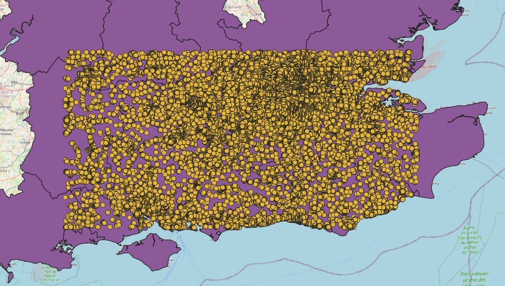

- Make sure the `prac3-data — counties_unitary_authorities_dec_2024_imd_pop2024` layer is selected in the Layers window - it should be highlighted in blue or grey. 
- Use the **Select Features** 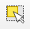{ height=20 } tool to draw a rectangle across the point data. It should highlight most of the polygons:

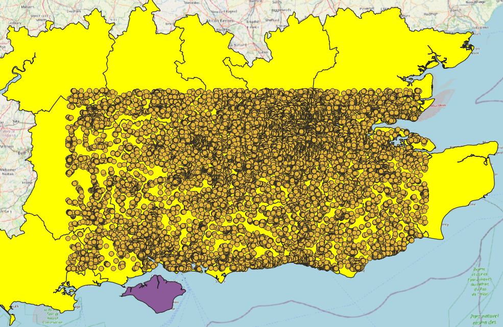

- Now hold down **Ctrl** on the keyboard (**Cmd** on a Mac) and click each of the areas where we don't have complete data:

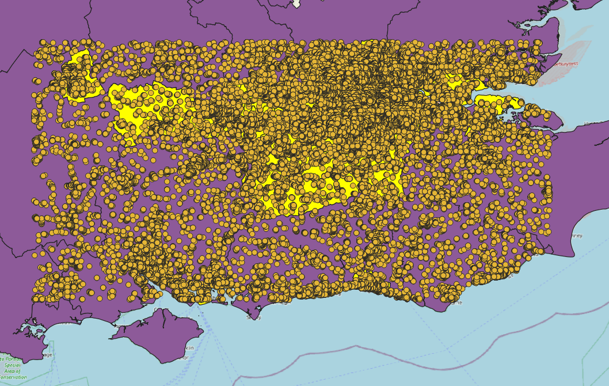

- Turn off the points layer, and you should have something like this:

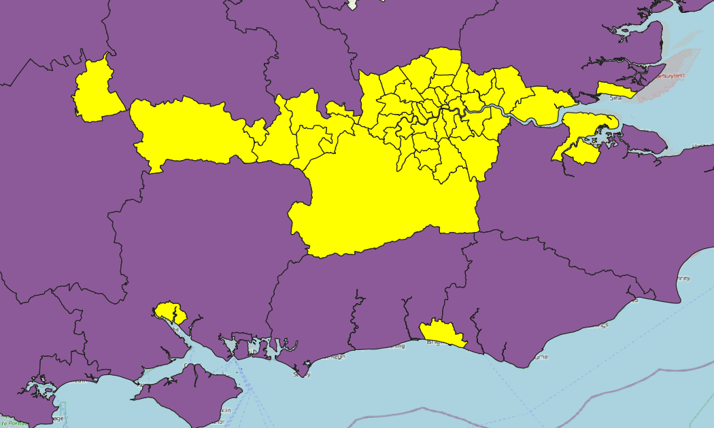
- Right click on the `prac3-data — counties_unitary_authorities_dec_2024_imd_pop2024` and choose **Export > Save Selected Features As...**.
- Save in our existing geopackage and set the file name to `counties_unitary_authorities_dec_2024_imd_pop2024_greenspace` 

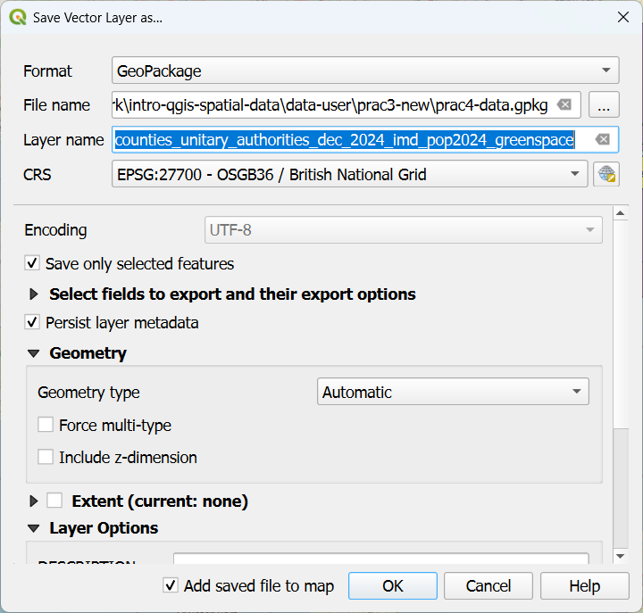{ width=50% }

Now we are going to group the data within each Local Authority. First, we will use **Point-in-Polygon** analysis to count how access points to greenspace there are in each Local Authority polygon. 

- Click **Processing > Toolbox**.  
- Type `count points` in the search box.  
- Double-click **Vector analysis > Count points in polygons**.  
- Set **Polygons** to your Local Authority districts layer *(which should have IMD and population data in it).*  
- Set **Points** to `prac3-data — AccessPoint`.  
- Click **Run**.  
- This has created a new layer called `Count` with a new column called `NUMPOINTS` at the far right hand end of the attribute table. 
- You can sort the `NUMPOINTS` column by clicking on the column header. It will sort it first ascending, then if you click again, descending. *Note there should not be any entries with a 0 value in them. These would be local authorities outside the greenspace data area. If you have any 0, try again or ask for help!*  
- If the calculation has worked, save this as a new GeoPackage layer by right-clicking on the layer, choosing **Export > Save Features As**.  
- Remember to choose the GeoPackage file name and a suitable name (e.g. `LA-IMD-pop-count`) for the layer:

{ width=50% }													 

Have a go at symbolising this data. 

We can also use some of the graphing options within QGIS to explore this data. 

- Click **Plugins > Manage and Install Plugins**  
- Search for **Data Plotly**  
- Click **Install Plugin**.  
- Click **Close**.  
- Click the Plotly icon 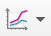{ height=20 }, probably at the right hand end of the icons.   
- *If you can't find the icon, make sure the entry under **View > Toolbars > Plugins Toolbar** is ticked.*  
- If it opens a tiny window in the bottom right hand corner, drag the window to the middle of the screen and make it bigger.  
- Make sure **Plot type** is set to `Scatter Plot`.  
- Set **Layer** to `LA-IMD-pop-count` (or `Count` if you didn't save your new layer).  
- Set **X field** to `NUMPOINTS`.  
- Set **Y field** to `RAvgRank`.  
- Choose **Create Plot** *it might take a few seconds to run*.  

*If `RAvgRank` isn't visible, you may have not done a join correctly earlier on. Try a different field, and try re-doing the join and exporting the joined layer.*

<!-- If you need it, the layer `prac3-data-nb lad-imd-pop-SUgreenspace` will all the information is available in the `prac3-complete.gpkg` GeoPackage - ask me for it. -->

If you end up with multiple sets of points on your plot, you can use the 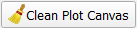{ height=20 } button on the main Plotly page { height=20 } to clear the plot and start again. 

Is there any sort of relationship in this data? 

There is one outlier - an area with a value of more than 6000 for NUMPOINTS (Greenspace access points). We can customise the plot and ignore the value of >6000. Click on the Cogs icon (top left) to return to the **Layout Options** page. Check **Set X Axis Bounds** and type **2000** in **Maximum**. Cluck Update Plot and have another look. 

What might be a better calculation is to look at number of greenspace access points per population, so we can correct for the fact that some local authorities have bigger populations than others. 

- Close the DataPlotly plot.  
- Open the attribute table for the layer we are using `LA-IMD-pop-count` and click the Editing icon { height=20 }.  
- Click **New Field** ({ height=20 })  
- Set **Name** to `GreenAccessPerPop`  
- Set **Type** to `Decimal number (real)`  
- Click **OK**.  
- Click **Field Calculator** 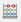{ height=20 }.  
- Choose **Update existing field** and set to `GreenAccessPerPop`.  
- Expand **Fields and Values** and double click `NUMPOINTS`.  
- Click **Divide** `/`  
- Double-click our **pop2024_Pop2024** field. *Expand the section of the window if you need to*.  
- Click **Multiply** `*` and type in `1000`. This will then calculate the number of greenspace access points per 1000 people.  
- The Expression box should contain something like this:  
`    "NUMPOINTS"  /  "pop2024_Pop2024"  * 1000 `.   
- It should give you a preview value for **E06000030** of `6.35`.  
- Click **OK**.  
- Save the data and toggle off editing.
- Create the Plotly plot again

Try symbolising this data and/or graphing the data - do you see any patterns here?

Now we have something - there are no deprived areas (low RAvgRank) with lots of greenspace access points per pop. 

*If you get stuck, a video recording of me working through this practical is available on [YouTube](https://youtu.be/Gvg-YzUWSDA).* 

\newpage

# Practical 4: Spatial Overlays

| **Learning outcomes:**  | 
|---| 
| Be able to perform a polygon polygon overlay |
| Critique the analysis process we have undertaken |

This is a lighter touch practical. You will need to work out some of the steps for yourself!

## Polygon polygon overlay

We will be combining the layers using the Union tool, and we need to do some preparation for this. 

- Open up your project file from the previous practical, and save it as a new file (e.g. `prac4-v1.qgz`).  
- Add the `SU_GreenspaceSite.shp` and `TQ_GreenspaceSite.shp` files to our project.  Now is also a good time to remove any layers we don't need, for example many of the Excel datasets we joined.  
- It is always good practice to work on a copy of your data, so take a copy of our geopackage from the previous practical (by copying it in Windows Explorer / My Computer / Finder) and save it in the `prac4` folder. I have called mine `prac4-data.gpkg`.  
- Then add your new GeoPackage to QGIS.  
- Then we can add the greenspace area data to this prac4-data.gpkg geopackage.  
- Remember we need to merge the two layers? Use **Vector > Data Management Tools > Merge Vector Layers** to merge the greenspace area data. 
- Then save merged data in to our new geopackage. Right click on the layer (`Merged`), choose **Export > Save Features As**.  
- Select the `prac4-data.gpkg` geopackage.  
- Call the layer `GreenspaceSite` and choose **OK**.  
- It will appear as `prac4-data — GreenspaceSite`.  

We have already updated the `LA-IMD-pop-count` layer to only include Local Authorities that we have complete greenspace data for, so we don't need to change this. However it is worth double checking - do we have complete greenspace data for the Local Authorities we are working with?

- We also need to do one final bit of preparation on the local authority data - calculate and add the area to the attribute table.  
- Open the attribute table for the `prac3-data — LA-IMD-pop-count` layer.  
- Turn on **Editing** { height=20 } and click **Add Field** (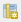{ height=20 }).  
- Set the **Name** to `LAarea`.  
- Set **Type** to `Decimal number (real)`.  
- If you have the option, set **Length** to `10` and **Precision** to `4`. *If you don't have these options, that is fine.*    
- Click **OK**.  
- Click **Field Calculator** ({ height=20 }).  
- Choose **Update existing field** and set to `LAarea`.  
- Expand **Geometry** and double-click `$area`. This will add the area in square meters (as our coordinate system is BNG).  
- This should come out (as a preview)  at `230246544` (m) for E06000030.    
- Add `/ 10000` to our expression to divide this by 10,000, to get 23,024 hectares.  
- Click **OK** to apply the calculation across all the rows.  

- Make sure to turn Editing off { height=20 } and save your edits.  

- In the `prac4-data — GreenspaceSite` layer add a new column called `greenspace`.  
- Use **New Field** { height=20 } and set the data type to **Integer (32 bit)**.  
- Then use **Field Calculator** { height=20 } to set all the entries in this column to `1`.   
- Find and open the **Union** tool in the **Processing Toolbox**.  
<!-- Union, not Union (multiple). Add pic? --> 

- Set the **Input layer** to `prac3-data — LA-IMD-pop-count` (our local authority data).  
- Set the **Overlay layer** to `prac4-data GreenspaceSite` (the greenspace site layer).  
- Click **Run**, it may take a minute or two to run. Watch the progress bar, and while you wait, review the flowchart on the slides and make sure you know what output you are expecting (or have a short break!).   

- Open the attribute table of the layer we have just created (`Union`).  

Now we have an attribute table split by Local Authority and greenspace. Within each Local Authority we have one polygon that is non greenspace (where the `greenspace` value is NULL) and one or more polygons that are greenspace (where the `greenspace` value is `1`). The next step is to calculate the area for each polygon. 

*We do have quite a few blank rows (with greenspace data but no Local Authority data). These are the greenspace areas that are outside our local authority data. Try selecting one and using the Zoom To function.*

- Save this as a new layer called `greenspace-LAs`. You may get this error message if you save it in a GeoPackage:

<!-- This is only a problem in QGIS 3.38 or below. It is fine and doesn't give an error in QGIS 3.40.12, 3.40.5 or 3.44.4 -->

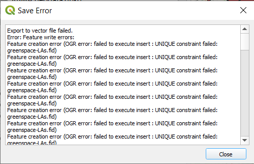{ width=40% }

*It won't save in the geopackage (because `fid` is not unique, one of the requirements). We could save it as an ESRI Shapefile which will be fine. The better way is to remove and recalculate the `fid` field, which will then be unique, so we can save it in a geopakcage.*

- Open the Attribute Table for the `Union` layer and delete the `fid` field. Then try saving again.  
_ You might then also get this error:

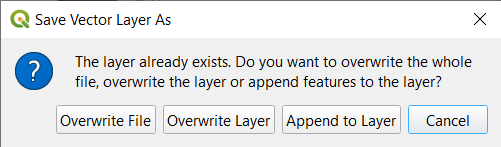{ width=50% }

- This is saying this layer already exists in the geopackage (as we saved it earlier, but it didn't save properly because of the error). Click **Overwrite Layer** to overwrite this with the new (correct) layer. 
- **Be careful because you could overwrite the whole geopackage!**

Now we can merge the polygons so we have a dataset that lists each Local Authority area twice, once with greenspace and once without. 

- Make sure everything is de-selected (by clicking 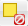{ height=20 })  
- Use the **Dissolve** tool from **Processing Toolbox** (under **Vector geometry**).  
- Set **Input** to `greenspace-LAs`.  
- Click the Browse { height=20 } button next to **Dissolve field(s)**.
- Select `CTYUA24CD` and `greenspace`. Choose **OK**.  
- Click **Run**.  
- Look at the new layer, `Dissolved`. Has it done what we wanted it to?  
- Save as `dissolved-greenspace-LAs`.  
- Open the attribute table and use **Select features using an expression** 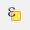{ height=20 } to select the rows where `greenspace = 1`.  
- Save this as a new layer `dissolved-greenspace-LAs-single` using **Save Selected Features As...**.  																																	  
- Open the attribute table for the `dissolved-greenspace-LAs-single` layer.  
- Turn on **Editing** { height=20 } and click **Add Field** ({ height=20 }).  
- Set the **Name** to `greenspace-area`.  
- Set **Type** to `Decimal number (real)`.  
- Set **Length** to `10` and **Prevision** to `4` *if you have these options*.   
- Click **OK**.  
- Click **Field Calculator** ({ height=20 }).  
- Choose **Update existing field** and set to `greenspace-area`.  
- Expand **Geometry** and double-click `$area`. This will add the area in square meters (as our coordinate system is BNG).  
- Add `/ 10000` to our expression to divide this by 10,000, to get the value in  hectares.  
- Click **OK** to apply the calculation across all the rows.  
- Turn Editing off.  

Now we have the total LA area (`LAarea`) and the greenspace area (`greenspace-area`). 

- Use **Field Calculator** to create a new field (`pc_greenspace`) and calculate the percentage of greenspace (`("greenspace-area"  /  "LAarea" ) * 100`). 

<!-- check field format, some are text for area etc. -->

This gives us a nice output of the proportions of greenspace. 

Try creating a plotly graph with this - is there any relationship now? What about area of greenspace per thousand people?

We could perform a similar process, but with the greenspace buffered. This would be a proxy for 'accessible' green space. Try buffering the greenspace data at 300m, and repeat the process. 

----

*This practical was written using QGIS 3.40 on Windows 11, last updated on 01/03/2026 by Dr Nick Bearman, [nick@nickbearman.com](mailto:nick@nickbearman.com).*

This work (Advanced QGIS: Spatial Analysis by Nick Bearman) is licensed under the Creative Commons Attribution-NonCommercial-ShareAlike 4.0 International. To view a copy of this license, visit http://creativecommons.org/licenses/by-nc-sa/4.0/. 

The latest version of the PDF is available from https://github.com/nickbearman/intro-qgis-spatial-data. This is v6.3 and this was created on `r format(Sys.time(), '%d %B %Y')`. 