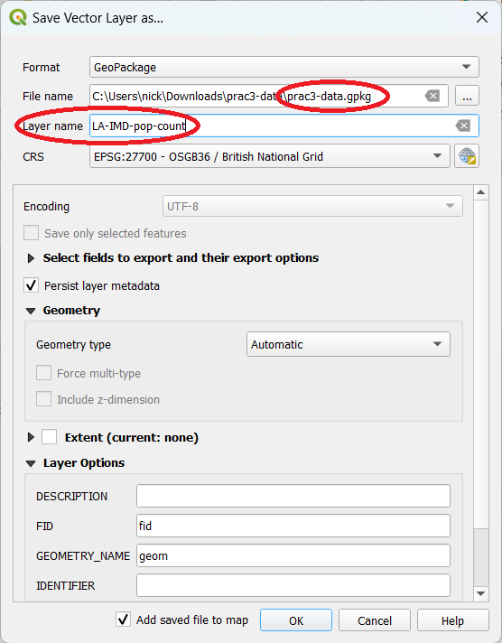
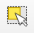
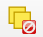

# Practical 3a: Recap of QGIS and Choropleth Maps

| **Learning outcomes:**  | 
|---| 
| Remember how to load data, join data and symbolise data | 

We are going to start with a quick recap of QGIS, including loading data and creating a choropleth map. Create a folder in Documents where you can save files relating to your GIS practical. 

We are working with the IMD (Index of Multiple Deprivation) data again, but this time at the Local Authority level. 

- Open **QGIS** and start a new project.  
- Open the **Open Data Source Manager** { height=20 } 

- Add the 
`Local_Authority_Districts_April_2019_Boundaries_Southern` layer from the `prac2-data.gpkg` geopackage we used in the previous session. 

- To get the IMD data for each Local Authority, go to https://www.gov.uk/government/statistics/english-indices-of-deprivation-2019 (or search for `IMD Local Authority`).  

- Download the entry for **File 10: local authority district summaries**. 

<!-- Last checked 2022-03-02 -->

- Open this file in Excel to have a look at it. Note the different tabs along the bottom - we want to use the **IMD** tab later. 

- Close Excel.  

- In QGIS open the **Open Data Source Manager** { height=20 } and browse to the Excel file you have just downloaded.  
- Expand the `File_10_-_IoD2019_Local_Authority_District_Summaries__lower-tier__` file and double click on `IMD`.  
- Close the **Data Source Manager**.  
- Right click on both of the layers you have just added and **Open Attribute Table**.  
- We are going to join these two layers together using the code for each local authority - the `lad19cd` in the Local Authority Districts boundary file and the `Local Authority District code (2019)` in the IMD file.  
- Close both attribute tables.  
- Right click on the `Local_Authority_Districts_April_2019_Boundaries_Southern` layer and choose **Properties**.  
- Click on **Joins** { height=20 }.  
-	Click on the plus button { height=20 } to create a new join. The **Add Vector Join** dialogue box will now open  
-	Make sure that `IMD` is selected in the **Join layer** dropdown box  
-	`Local Authority District code (2019)` should be selected in the **Join field** dropdown box  
-	`lad19cd` should also be selected in the **Target field** dropdown box  
- Click **OK** and **OK** again.  
- Check whether the join worked correctly by looking the in the Local Authority layer Attribute Table.  
- Each Local Authority should now have an **Average score** and **Average rank**.  
- What do these fields represent? Check the details on the website and in the Excel file if you are not sure.  

The join that we have made is not permanent; it is a temporary link between the two datasets. To make the Join permanent we need to save a new copy of the local authorities layer. Try this, based on what you can remember from the previous sessions. You can always go back and check the notes if you need to! Try saving this as a new GeoPackage. 

- Save our joined layer as a new layer in a GeoPackage.  

- Remember to choose the GeoPackage file name and the layer name:

{ width=50% }

Now our data is in, and joined to our spatial data, we can create a choropleth map. Remember how important the classification process is - which classification method we choose can have a big impact on the map we create. 

- Open the **Layer Properties** window and the **Symbology** tab of the layer.  
- Where the option says **Single symbol** at the top, change this to **Graduated**.  
- Select the `IMD_IMD - Average score` field from the column drop-down list.  
- The click **Classify**, you will see the 5 classes for this data set appear in the window.  
- Click **Apply** or **OK**, and QGIS will update the map. 

### Optional Exercises

- Try adding the football stadium data on top of the IMD data.  

- Try loading in the Style template that we used before  `prac2-imd-d-style.qml` on to the LA-with-IMD layer. *Remember the option is under Properties > Symbology > Style > Load Style.... You will also need to update the column used for `Value`.*   

- How would you produce a map, showing both the IMD data and the football stadiums? What about showing context to people using the map can orientate themselves?  

*If you get to the end of the recap, and are happy with what we have covered, please carry on with the next practical. If some things are unclear, then please ask for help.*

----

# Practical 3b: Joining Population Data

| **Learning outcomes:**  | 
|---| 
| Be able to join data from a variety of sources |
| Know how to change data from one data type to another |

We are now going to join some more tabular data - populations this time. We need to download some data to begin with. 

- Continue with your existing QGIS project.  
- Do a Google search for `mid year population estimates lad`.  
- One of the first hits should be **Estimates of the population for the UK, England and Wales** at the ONS. Go to this link.  
- The web address of this is https://www.ons.gov.uk/peoplepopulationandcommunity/populationandmigration/populationestimates/datasets/populationestimatesforukenglandandwalesscotlandandnorthernireland.  
- We want the **Mid-2019: April 2019 local authority district codes** data. Click on the **xls (2.4 MB)** rectangle to download it.  
- The file is called `ukmidyearestimates20192019ladcodes.xls` and save it somewhere you can find it.   
- Have a look at the file we have just downloaded in Excel.  
- We are using the `MYE2 - Persons` sheet, and column A has the LA code in it, and column D has the total population in it.   
- In QGIS open the **Open Data Source Manager** { height=20 } and browse to the Excel file you have just downloaded.   
- Double click on the `ukmidyearestimates20192019ladcodes.xls` file and then double click on `MYE2 - Persons` to add it to QGIS.  
- Close the **Data Source Manager**.  
- Right click on the layer you just added and **Open Attribute Table**.  
- Again, we are going to be joining the LA codes, but QGIS has rather unhelpfully labelled the columns `Field1`, `Field2` etc., so we will need to rename these.  
- Also, some of the columns with numbers in, if you look carefully, some are aligned left and some are aligned right.  
- Close the attribute table.  
- Right click on the `MYE2 - Persons` layer and choose Properties. Go to the { height=20 } **Fields** option.  
- This list all the columns in the data set and what data types they are.  
- We need to update the field names and types but at the moment, editing is disabled { height=20 } because QGIS can't edit XLSX files.  
- Save this layer (`MYE2 - Persons`) into the geopackage you created in practical 3a ((**right-click > Export > Save Features As...**)).  
- *As this is only a table of data, it won't have a valid projection, so QGIS listing CRS: Invalid Projection is fine.* 

<!-- Be clearer this is just a table we are saving - it won't have a CRS --> 

- Return to the **Fields** window (within **Properities**) and now we should be able to edit { height=20 } .  
- Click the **Edit** { height=20 } icon and change `Field1` to `LAcode` and `Field4` to `Pop2019`.  
- Untoggle Editing { height=20 } and choose **Save** when prompted.   

The `Pop2019` column contains population data, but QGIS thinks it is a String (text). QGIS then wouldn't be able to display the data, or create a choropleth map with it. We need to change the format from String (text) to Double (number).

- Click **Processing > Toolbox**.  

*If the **Processing** option is not visible (between Mesh and Help on the menu bar at the top of the screen) you may need to enable it. Go to **Plugins > Manage and Install Plugins**. Go to **Installed** and search for **Processing**. Click **Close** and **Processing** should appear in the menu bar between Mesh and Help.* 

- Type `Refactor` in the search box.  
- Double click on **Refactor fields** *it might take a little while to load*.  
- Make sure we have our new MidYearEstimates layer in the **Input Layer** box.  
- Change our **Pop2019** field from `Text (string` to `Decimal number (double)`.  
- Click **Run**.  
- *If it gives us an error message this may not be a problem - check the output.*  
- When it has finished running, click **Close**.  

This has added a new layer called **Refactored**. It has a little memory chip icon { height=20 } next to it, which means it isn't saved anywhere. 

- Use the **Fields** view in **Properties** to check that the **Refactored** layer now has the population data in the correct data type. Also check in the **Attribute Table** that the data look sensible.    
- Also use the **Fields** window to delete the extra columns - we should be left with `fid`, `LAcode` and `Pop2019`. Remember to turn **Editing** off.  
- Right click on the layer and choose **Export > Save Features As...** and save it in our GeoPackage. This will make the layer permanent and removed the temporary layer icon.  

Now our layer is ready to join. 

- We are going to join these two layers together using the code for each local authority - the `lad19cd` in the Local Authorities boundary file and the `LAcode` in the Mid Year Estimates layer.  
- Right click on the `Local_Authority_Districts_April_2019_Boundaries_Southern` layer and choose **Properties**.  
- Click on **Joins** { height=20 }.  
-	Click on the plus button { height=20 } to create a new join. The **Add Vector Join** dialogue box will now open  
-	`LAcode` should be selected in the **Join field** dropdown box  
-	`lad19cd` should be selected in the **Target field** dropdown box  
- Click **OK** and **OK** again.  
- Check whether the join worked correctly by looking the in the Local Authority layer Attribute Table.  
- Each Local Authority should now have a population as well as the IMD data from earlier.  

The join that we have made is not permanent; it is a temporary link between the two datasets. To make the Join permanent we need to save a new copy of the local authorities layer. Try this, based on what you can remember from yesterday. You can always go back and check yesterday's notes if you need to!

*We should have done the presentation on greenspace access points by the time you get to here. If you get to this point and we haven't, please let me know.*

Try symbolising the different data - IMD and population on the map. What colours / classification works best?

----

\newpage

# Practical 3c: Greenspace Access Points

| **Learning outcomes:**  | 
|---| 
| Know how to download data from Ordnance Survey Open Data |
| Be able to complete point in polygon anaylsis in QGIS |
| Understand how to create graphs in QGIS |

## Point in Polygon Analysis

Using our Local Authority datasets, we are going to complete some calculations on Greenspace access and area.

- Do a Google search for `os open data`.  
- **OS OpenData download - OS data downloads | OS Data Hub** should be the first hit - go to this page.   The web address is https://osdatahub.os.uk/downloads/open.  
- Search (or scroll down) to find **OS Open Greenspace** and click the link.  
- Choose **Set a custom area:**  
- Click on the **SU** entry on the map of the British Isles to select the SU tile of data and click **Save selection**.  
- Set the **Data format:** to `ESRI Shapefile`.  
- Click the link **OS Open Greenspace - ESRI® Shapefile SU (2.3 MB)** to download.  
- Unzip the data and have a look at the files - in the data folder there should be two shape files `SU_AccessPoint.shp` and `SU_GreenspaceSite.shp`.  

<!-- Last checked 2022-03-02 -->

Now we can move to QGIS. Reopen your existing project from the previous practical, and save as a new project.  

- Select from the menu **Layer > Add Layer > Add Vector Layer** { height=20 }.  
- **Browse** { height=20 } to the `SU_AccessPoint.shp` file and add it.  
- Pan to the Winchester local authority (try labelling them as we did yesterday if you need to).  
- Each of the dots is an access to an area of greenspace. Try using the **Identify Features** tool { height=20 } to see what information we have about each access point.  
- Zoom in and have a look at the points. It may be useful to add the OSM Basemap layer, like we did yesterday.  

By default, the OSM Standard basemap uses the WGS84 / Pseudo Mercator projection. Most of the data we will be using will be in British National Grid. QGIS will automatically re-project GIS data if it knows what the coordinate system is. QGIS has a 'Project CRS' which is what the data are shown in the main window. Depending on your settings, this may be set to **EPSG:3857** (WGS 84 / Pseudo Mercator) or **EPSG:4326** (WGS 84).  

- If the CRS symbol { height=20 } at the bottom right hand side of the QGIS window says **EPSG:3857** or **EPSG:4326**, click on it.  
- Type `27700` in the **Filter** box and select **OSGB 1936 / British National Grid** - **EPSG:27700**.  
- Click **OK**. Now QGIS will re-project everything to British National Grid (27700).  

Now we are going to group the data within each Local Authority. First, we will use **Point-in-Polygon** analysis to count how access points to greenspace there are in each Local Authority polygon. 

- Click **Processing > Toolbox**.  
- Type `count points` in the search box.  
- Double-click **Vector analysis tools > Count points in polygons**.  
- Set **Polygons** to your Local Authority districts layer *(which should have IMD and population data in it).*  
- Set **Points** to `SU_AccessPoint`.  
- Click **Run**.  
- This has created a new layer called `Count`.  
- Some of the layers should have points in - remember, the SU grid square doesn't cover all of the local authorities, so some will be blank and some will be incomplete.  
- You can sort the `NUMPOINTS` column by clicking on the column header. It will sort it first ascending, then if you click again, descending.  
- If the calculation has worked, save this as a new layer.  

Have a go at symbolising this data. 

We can also use some of the graphing options within QGIS to explore this data. 

- Click **Plugins > Manage and Install Plugins**  
- Search for **Data Plotly**  
- Click **Install Plugin**.  
- Click **Close**.  
- Click **Plugins > DataPlotly > DataPlotly**.  
- If it opens a tiny window in the bottom left hand corner, drag the window to the middle of the screen and make it bigger.
- Make sure **Plot type** is set to `Scatter Plot`.  
- Set **Layer** to `Count` (or your new layer if you saved it).  
- Set **X field** to `NUMPOINTS`.  
- Set **Y field** to `IMD_IMD - Average score`.  
- Choose **Create Plot** *it might take a few seconds to run*.  

*If `IMD_IMD - Average score` isn't visible, you may have not done a join correctly earlier on. Try a different field, and try re-doing the join. If you need it, the layer `prac3-data-nb lad-imd-pop-SUgreenspace` will all the information is available in the `prac3-complete.gpkg` GeoPackage - ask me for it.*

If you end up with multiple sets of points on your plot, you can use the { height=20 } button on the main Plotly page { height=20 } to clear the plot and start again. 

Is there any sort of relation in this data? 

What might be a better calculation is to look at number of greenspace access points per population, so we can correct for the fact that some local authorities have bigger populations than others. 

- Close the DataPlotly plot.  
- Open the attribute table for the layer we are using and click the Editing icon { height=20 }.  
- Click **New Field** ({ height=20 })  
- Set **Name** to `GreenAccessPerPop`  
- Set **Type** to `Decimal Number (real)`  
- Click **OK**.  
- Click **Field Calculator** { height=20 }.  
- Choose **Update existing field** and set to `GreenAccessPerPop`.  
- Expand **Fields and Values** and double click `NUMPOINTS`.  
- Click **Divide** `/`  
- Double-click our **Pop2019** field. *Expand the section of the window if you need to*.  
- Click **Multiply** `*` and type in `1000`. This will then calculate the number of greenspace access points per 1000 people.  
- The Expression box should contain something like this:  
`  "NUMPOINTS"  /  "prac3-data-nb MYE2 - Persons Refactored_Pop2019"  * 1000 `.  
- It should give you a preview value for **Arun** of `1.225`.  
- Click **OK**.  
- Save the data.  
   

Try symbolising this data and/or graphing the data - do you see any patterns here?

\newpage

# Practical 4: Spatial Overlay - Greenspace and Local Authorities

| **Learning outcomes:**  | 
|---| 
| Be able to perform a polygon polygon overlay |
| Critique the analysis process we have undertaken |

This is a lighter touch practical. You will need to work out some of the steps for yourself!

## Polygon Polygon Overlay

We will be combining the layers using the Union tool, and we need to do some preparation for this. 

- Open up your project file from the previous practical, and save it as a new file (e.g. `prac4-NB-v1.qgz`).  
- Add the `SU_GreenspaceSite.shp` to our project.  Now is also a good time to remove any layers we don't need, for example many of the CSV datasets we joined.  
- It is always good practice to work on a copy of your data, so take a copy of our geopackage from the previous practical, save it in the `prac4` folder. I have called mine `prac4-data.gpkg`.  
- Then we can add the greenspace area data to this prac4-data.gpkg geopackage.  
- To do this, right click on the layer (`SU_GreenspaceSite`), choose **Export > Save Features As**.  
- Select the `prac4-data.gpkg` geopackage.  
- Call the layer `SU_GreenspaceSite` and choose **OK**.  
- It will appear as `prac4-data — SU_GreenspaceSite`.  

The greenspace layer and the LA layer don't cover the same area, so we need to remove the local authorities for which we don't have complete greenspace data. 

There are various ways of doing this - the easiest is manually!

- Save the local authorities layer (which should already have the IMD and population data in it) into our `prac4-data` geopackage using the same method as above. Call it `lad-imd-pop-SUgreenspace`.  
- Remove the `prac3-data lad-imd-pop-SUgreenspace` layer, so we only have one local authority layer.  
- Select the `prac4-data lad-imd-pop-SUgreenspace` layer and start editing { height=20 }. 
- Use the **Select Features** { height=20 } tool to pick one of the local authorities for which we do not have complete greenspace data. It should go yellow, with a red outline. 
- Use the `Delete` key on the keyboard to delete this polygon.  
- Repeat this for each of the local authorities poking out of the greenspace data. You should end up with something like this:

{ width=60% }

- We also need to do one final bit of preparation on the local authority data - calculate and add the area to the attribute table.  
- Open the attribute table for the `prac4-lad-imd-pop-SUgreenspace` layer.  
- Turn on **Editing** { height=20 } and click **Add Field** ({ height=20 }).  
- Set the **Name** to `LAarea`.  
- Set **Type** to `Decimal number (real)`.  
- If you have the option, set **Length** to `10` and **Precision** to `4`. *If you don't have these options, that is fine.*    
- Click **OK**.  
- Click **Field Calculator** ({ height=20 }).  
- Choose **Update existing field** and set to `LAarea`.  
- Expand **Geometry** and double-click `$area`. This will add the area in square meters (as our coordinate system is BNG).  
- This should come out (as a preview)  at `634273160` (m) for Basingstoke and Deane.    
- Add `/ 10000` to our expression to divide this by 10,000, to get 63,427 hectares.  
- Click **OK** to apply the calculation across all the rows.  

- Make sure to turn Editing off { height=20 } and save your edits.  

- In the `prac4-data — GreenspaceSite` layer add a new column called `greenspace`.  
- Use **New Field** { height=20 } and set the data type to **Whole number (integer)**.  
- Then use **Field Calculator** { height=20 } to set all the entries in this column to `1`.   
- Find and open the **Union** tool in the **Processing Toolbox**.  
- Set the **Input layer** to `prac4-data lad-imd-pop-SUgreenspace` (our local authority data).  
- Set the **Overlay layer** to `prac4-data SU_GreenspaceSite` (the greenspace site layer).  
- Click **Run**, it may take a minute or two to run. Watch the progress bar, and while you wait, review the flowchart on the slides and make sure you know what output you are expecting (or have a short break!).   

- Open the attribute table of the layer we have just created (`Union`).  

Now we have an attribute table split by Local Authority and greenspace. Within each Local Authority we have one polygon that is non greenspace (where `greenspace` is NULL) and one or more polygons that are greenspace (where `greenspace` is `1`). The next step is to calculate the area for each polygon. 

*We do have quite a few completely blank rows (with greenspace data but no Local Authority data). These are the greenspace areas that are outside our local authority data. Try selecting one and using the Zoom To function.*

- Save this as a new layer called `greenspace-LAs`. You will get this error message if you save it in a GeoPackage:

{ width=40% }

*It won't save in the geopackage (because `fid` is not unique, one of the requirements). We could save it as an ESRI Shapefile which will be fine. The better way is to remove and recalculate the `fid` field, which will then be unique, so we can save it in a geopakcage.*

- Open the Attribute Table for the `Union` layer and delete the `fid` field. Then try saving again.  
_ You might then also get this error:

{ width=50% }

- This is saying this layer already exists in the geopackage (as we saved it earlier, but it didn't save properly because of the error). Click **Overwrite Layer** to overwrite this with the new (correct) layer. 
- **Be careful because you could overwrite the whole geopackage!**

- Open the attribute table for the `greenspace-LAs` layer.  
- Turn on **Editing** { height=20 } and click **Add Field** ({ height=20 }).  
- Set the **Name** to `area`.  
- Set **Type** to `Decimal number (real)`.  
- Set **Length** to `10` and **Prevision** to `4` *if you have them*.   
- Click **OK**.  
- Click **Field Calculator** ({ height=20 }).  
- Choose **Update existing field** and set to `area`.  
- Expand **Geometry** and double-click `$area`. This will add the area in square meters (as our coordinate system is BNG).  
- Add `/ 10000` to our expression to divide this by 10,000, to get the value in  hectares.  
- Click **OK** to apply the calculation across all the rows.  
- Turn Editing off.  

Now we can merge the polygons so we have a dataset that lists each Local Authority area twice, once with greenspace and once without. 

- Make sure everything is de-selected (by clicking { height=20 })  
- Use the **Dissolve** tool from **Processing Toolbox** (under **Vector geometry**).  
- Set **Input** to `greenspace-LAs`.  
- Click the Browse { height=20 } button next to **Dissolve field(s)**.  
- Select `lad19cd` and `greenspace`. Choose **OK**.  
- **Run**.  
- Look at the new layer, `Dissolved`. Has it done what we wanted it to?  
- Save as `dissolved-greenspace-LAs`.  
- Open the attribute table and use **Select features using an expression** { height=20 } to select the rows where `greenspace = 1`.  
- Save this as a new layer `dissolved-greenspace-LAs-single` using **Save Selected Features As...**.  
- Use **Field Calculator** to create a new field (`pc_greenspace`) and calculate the percentage of greenspace (`("area"  /  "LAarea" ) * 100`). 

<!-- check field format, some are text for area etc. -->

This gives us a nice output of the proportions of greenspace. 

Try creating a plotly graph with this - is there any relationship now? What about area of greenspace per thousand people?

We could perform a similar process, but with the greenspace buffered. This would be a proxy for 'accessible' green space. Try buffering the greenspace data at 300m, and repeat the process. 

----

*This practical was written using QGIS 3.22 on Windows 10, last updated on 04/06/2022 by Dr Nick Bearman, [nick@geospatialtrainingsolutions.co.uk](nick@geospatialtrainingsolutions.co.uk).*

This work (Introduction to QGIS: Spatial Data and Spatial Analysis by Nick Bearman) is licensed under the Creative Commons Attribution-NonCommercial-ShareAlike 4.0 International. To view a copy of this license, visit http://creativecommons.org/licenses/by-nc-sa/4.0/. 

The latest version of the PDF is available from https://github.com/nickbearman/intro-qgis-spatial-data. This is v6.0 and this was created on `r format(Sys.time(), '%d %B %Y')`. 